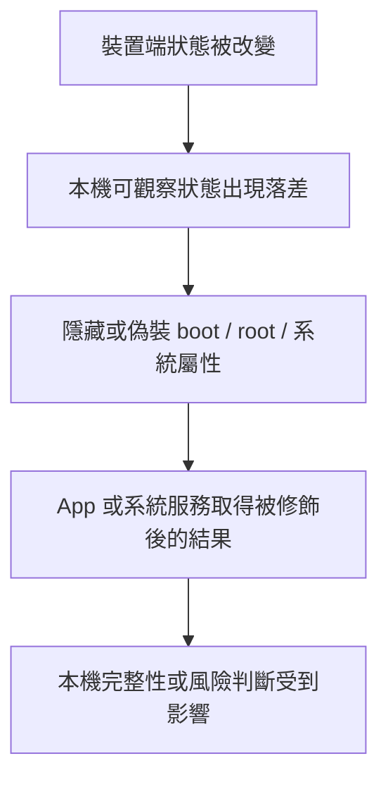
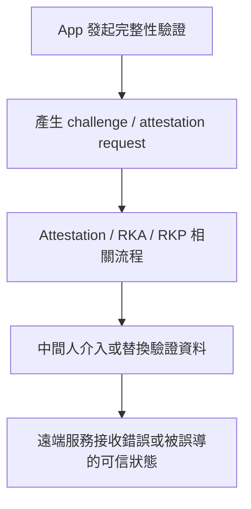
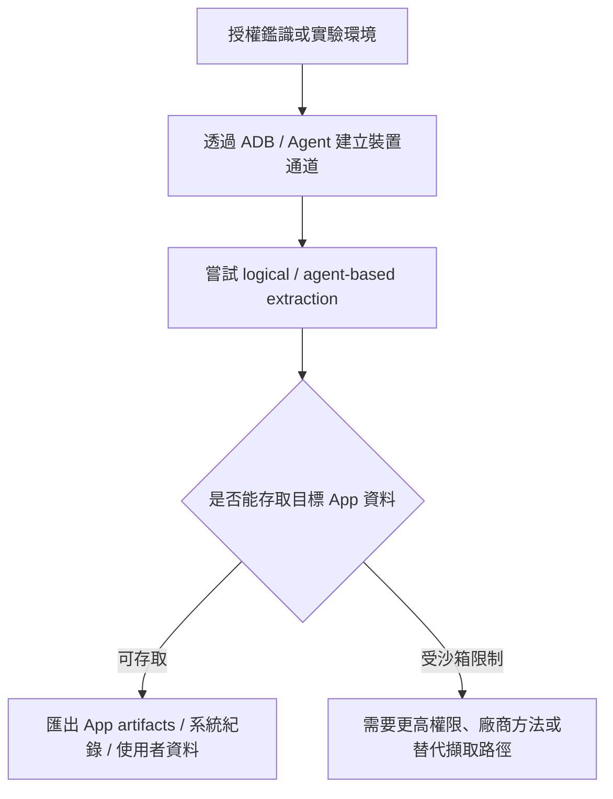
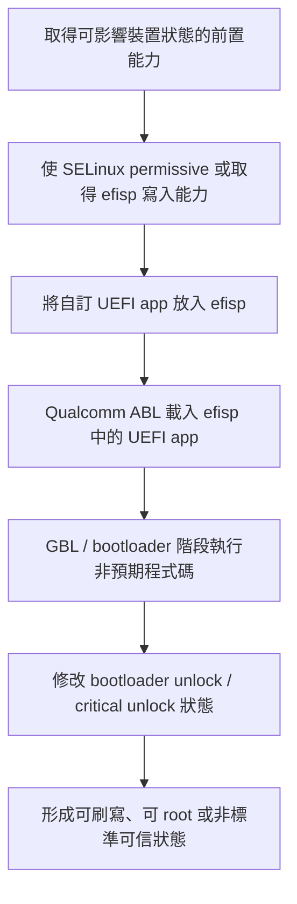
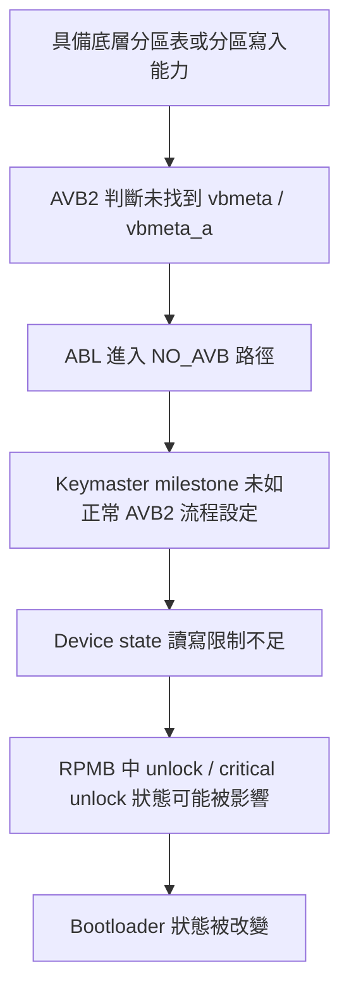

# 近期被利用之「免解鎖 Bootloader 取得 Root」漏洞列表

> 用途：資安研究、風險追蹤與防護評估。
> 
> 注意：請勿用於未經授權的測試或攻擊行為。

## 1. 已知漏洞與攻擊鏈總覽

### 1.1 漏洞 1：CVE-2025-21479（Qualcomm Adreno GPU micronode 記憶體破壞）

此漏洞出現在 Qualcomm Adreno GPU 的 micronode 指令處理流程中；公開描述指出，攻擊者可藉由特定指令序列觸發未授權命令執行與記憶體破壞。公開的 GitHub PoC 為：

- <https://github.com/zhuowei/cheese>
- <https://github.com/sarabpal-dev/cheese-cake>

若漏洞可被成功鏈接到系統提權路徑，可能進一步取得臨時 Root 權限，但實際影響仍會受到 SoC、GPU 世代、韌體版本與修補狀態影響。

在本報告的攻擊鏈整理中，CVE-2025-21479 與後述 ABL Cmdline Injection 的共同點，是它們都可能被用作**削弱 SELinux enforcing 限制**或使系統進入 **SELinux permissive** 狀態的前置入口。  
一旦 SELinux 強制存取控制失效，後續就可能接上其他本機提權技巧，例如 Xiaomi `IMQSNative` / `MQSAS` 服務呼叫，或 Magica 所代表的 isolated service / isolated process 類提權路徑。

社群實測回報（其他機型待驗證）：

- 來源：Coolapk 使用者「@羊了个羊了个羊了个羊」
- 連結：<https://www.coolapk.com/feed/70655251?s=NTFjZmEwYzkyN2NkOGUyZzY5YzYxOTM4ega1601>
- 重點：貼文內容描述在 Redmi Note 12 Turbo（標籤含 `#红米Note12Turbo`）結合 <https://github.com/zhuowei/cheese> 進行測試，回報可達到臨時 Root 相關效果。
- 註記：此為社群單點回報，建議以「可行跡象」歸檔，後續仍需多機型與多版本交叉驗證。

---

### 1.2 漏洞 2：ABL Cmdline Injection（fastboot OEM / ABL 命令列注入漏洞鏈）

此類漏洞鏈的核心在於 Qualcomm ABL（Android Bootloader）對 `fastboot oem` 某些參數的驗證不完整，導致不受信任的輸入被帶入 kernel cmdline。公開討論中，研究者展示了可藉由 OEM 指令額外注入如 `androidboot.selinux=permissive` 之類的啟動參數，進而削弱開機後的強制安全限制。

Qualcomm 對應修補提交也直接將問題描述為：

`Fix propagation of untrusted input into kernel cmdline`

因此，這條鏈本身通常不是最終目的，而是作為後續提權、臨時 Root、甚至免解鎖 Bootloader 操作的前置條件之一。

#### 1.2.1 補充：其他已知利用方式與組合鏈

除了常見的：

```bash
fastboot oem set-gpu-preemption 0 androidboot.selinux=permissive
```

另有相似利用方式：

```bash
fastboot oem set-hw-fence-value 0 androidboot.selinux=permissive
```

這類問題的核心相同，都是原本只應接受數值參數的 `fastboot oem` 指令，卻可能將額外輸入內容帶入 kernel cmdline，進而注入 `androidboot.selinux=permissive`，使系統於開機後進入 **SELinux permissive** 狀態，而非 enforcing。

已知情況如下：

- `set-gpu-preemption` 這一路徑可用於關閉 SELinux 強制執行，屬於 **Qualcomm 限定**，目前已存在修補提交。
- `set-hw-fence-value` 為另一個相似變體，亦已修補；公開討論中指出此類問題屬於較早期引入的老漏洞，理論上可能適用於更多 Qualcomm SoC。
- 版本分佈觀察（社群回報）：目前較多可利用回報集中在 **HyperOS 2 / HyperOS 3**；其他版本仍需更多樣本與獨立驗證。

此外，在 **Xiaomi 裝置** 上，公開討論中亦提到可配合使用下列系統服務呼叫：

```bash
service call miui.mqsas.IMQSNative 21 i32 1 s16 "命令" i32 1 s16 "参数列表" s16 "输出路径" i32 600
```

其重點在於：若可成功呼叫對應服務介面，可能以 **root 權限執行任意命令**。

不過，這裡的順序很重要：必須先透過 CVE-2025-21479、Qualcomm ABL cmdline injection，或其他方式使 SELinux enforcing 失效 / 進入 `SELinux permissive`，之後才有機會配合後續本機提權技巧形成完整鏈。

目前公開討論中較常被提到的後續路徑包含兩類：

1. **Xiaomi `IMQSNative` / `MQSAS` 服務路徑**：在 SELinux permissive 後，若可呼叫對應系統服務介面，可能以 root 權限執行命令。
2. **Magica / isolated service 路徑**：Magica README 將其描述為 Android 10+ 在 seccomp disabled 情境下的 privilege escalation PoC；公開討論亦提到，SELinux permissive 後可利用 isolated service / isolated process 類技巧進一步提權。

以 Xiaomi `IMQSNative` / `MQSAS` 為例，利用鏈大致可整理為：

1. 先透過 ABL 類漏洞注入 `androidboot.selinux=permissive`
2. 使系統以 **SELinux permissive** 狀態啟動
3. 再呼叫 Xiaomi 系統服務 `miui.mqsas.IMQSNative`
4. 進一步取得 **root 身份任意命令執行**

在此情況下，可形成 **完整 root 權限取得**。

若採用 Magica / isolated service 類路徑，則重點不在於特定 Xiaomi 服務，而是在 **SELinux permissive** 或其他安全限制被削弱後，利用 isolated service / isolated process 執行環境與系統服務邊界形成後續提權。  
因此，1.1 與 1.2 可視為「讓 SELinux 限制失效」的前置入口；`IMQSNative` 與 Magica 則是 permissive 之後可能銜接的不同提權分支。

參考資料：

- `set-gpu-preemption` 修補提交：
  <https://git.codelinaro.org/clo/la/abl/tianocore/edk2/-/commit/fb8e864254cdc370670233e3cb73a2b18ff33c9f>

- `set-hw-fence-value` 修補提交：
  <https://git.codelinaro.org/clo/la/abl/tianocore/edk2/-/commit/78297e8cfe091fc59c42fc33d3490e2008910fe2>

- Magica：
  <https://github.com/vvb2060/Magica>

- 討論來源：
  <https://t.me/vvb2060_Channel/17>
  <https://t.me/vvb2060_Channel/19>

> 註：
> - `ABL Cmdline Injection` 為整理用途的技術性名稱，用來統稱 fastboot OEM / ABL 參數驗證不完整、可導致 kernel cmdline 注入的漏洞鏈。
> - 小米已在 2026 年 2 月安全修補補丁中修補了相關問題

### 1.3 漏洞 3：GBL / UEFI Secure Boot Chain 類漏洞鏈（gbl_root_canoe）

參考專案：

- <https://github.com/superturtlee/gbl_root_canoe>

`gbl_root_canoe` 是近期針對新一代 Qualcomm 平台公開的 GBL / UEFI / ABL 相關研究專案。  
依照其公開說明，該專案並非單純修改 Android userspace，而是介入 **GBL / UEFI / ABL / efisp** 這一層的啟動鏈流程。

其核心風險可概括為：

- 影響範圍集中於較新的 Qualcomm 平台，尤其是 **Snapdragon 8 Elite Gen 5 / Snapdragon 8 Gen 5** 相關裝置。
- 利用點位於 Android 系統啟動前的 boot chain 階段。
- 可能透過替換、修補或重新封裝啟動鏈元件，改變裝置的啟動狀態、驗證流程或 fastboot 行為。
- 部分公開說明提到 `lockmode` / `unlockmode` 設計，顯示此類工具可能具備讓裝置在特定情境下呈現類似「假上鎖」狀態的能力。
- 此類漏洞鏈與傳統 Android userspace 提權不同，風險層級更接近 **bootloader / secure boot chain bypass**。

目前公開資料中提到的可能受影響平台，整理於 3.4「待驗證裝置」。

> 註：  
> 此處的「可能受影響」應理解為公開專案或社群研究中提到的觀察範圍，不代表每一台裝置、每一個韌體版本都已確認可利用。

---

### 1.4 漏洞 4：MTK Preloader 類漏洞鏈（OPPO / Realme / OnePlus）

參考專案：

- <https://github.com/Shocked-Cat/oppo-mtk-fastboot-unlock>

此類研究主要針對 **MediaTek 平台**，尤其是 OPPO / Realme / OnePlus 等 OPlus 系列裝置。  
公開專案描述指出，其核心方向是修改 factory preloader，並透過 mtkclient 寫入 preloader，以開啟 fastboot 存取或進一步解鎖 Bootloader。

其核心風險可概括為：

- 攻擊面位於 **MediaTek boot chain / preloader** 階段。
- 不是 Android userspace 層級漏洞。
- 可能透過修改 preloader 行為，改變裝置是否能進入 fastboot、是否能進一步執行解鎖流程。
- 在部分裝置上，解鎖或修改 boot chain 後可能造成 secure boot 狀態改變。
- 是否能達成免解鎖 Bootloader Root，需視裝置是否仍驗證後續映像、AVB / vbmeta 狀態、preloader 加密與廠商客製檢查而定。

> 註：  
> - MTK 裝置的可利用性高度依賴廠商實作。即使同為 MTK SoC，不同品牌、不同 preloader、不同 DA / auth 策略，結果也可能完全不同。
> - 已知 OPPO / Realme / OnePlus 的部分 MTK 裝置已在安全補丁 2025 年 Android 13 以上設備加密 DA，加密後僅可使用售後授權工具或是降級系統版本方式利用此類漏洞鏈。

---

### 1.5 漏洞 5：MediaTek Secure Boot Chain bypass（fenrir）

參考專案：

- <https://github.com/R0rt1z2/fenrir>

`fenrir` 是針對 MediaTek secure boot chain 的公開 PoC。  
其 README 描述該漏洞影響 **Nothing Phone (2a)** / **CMF Phone 1**，並可能影響其他 MediaTek 裝置。

公開說明中的重點包含：

- 漏洞位於 **MediaTek secure boot chain**。
- 問題核心是特定條件下，有元件未被正確驗證。
- 該 PoC 可在 Preloader 之後破壞 secure boot chain。
- README 提到可達成 **EL3 code execution**。
- 目前明確支援 Nothing Phone (2a)，CMF Phone 1 則已知可行但支援仍不完整。

- README 亦提到 PoC 中包含 spoof lock state 的能力，用於在裝置實際處於非標準狀態時呈現 locked 狀態。

可能受影響裝置清單整理於 3.2「Nothing / CMF」。

---

### 1.6 漏洞 6：Dirty Pipe（CVE-2022-0847）

Dirty Pipe（CVE-2022-0847）是 Linux kernel 中曾被公開利用的本地提權漏洞。  
此漏洞與 pipe buffer / page cache 寫入行為有關，攻擊者在特定條件下可能修改原本只讀的檔案快取內容，進而造成權限提升。

參考資料：

- CVE-2022-0847：<https://nvd.nist.gov/vuln/detail/CVE-2022-0847>
- Dirty Pipe 說明：<https://dirtypipe.cm4all.com/>
- Android 相關研究案例：<https://github.com/polygraphene/DirtyPipe-Android>
- Android 相關研究案例：<https://github.com/tiann/DirtyPipeRoot>

## 2. 可能被利用的後續攻擊手法

本節整理的是公開研究中常被搭配討論的攻擊手法。  
這些手法可以出現在不同階段：裝置端狀態被改變時、本機 App 或系統服務進行檢查時、網路驗證流程傳輸時，或遠端服務判斷裝置可信狀態時。

整理重點放在：

- 攻擊手法作用在哪一層
- 主要想繞過或干擾什麼判斷
- 常見需要搭配哪些條件
- 對裝置、App 或遠端服務可能造成什麼影響

### 2.1 本機繞過：裝置端信任狀態偽裝

本機繞過指的是攻擊者已經在裝置端取得足夠控制能力後，嘗試改變或隱藏本機可觀察到的狀態，使 App、系統服務或完整性檢查元件無法正確判斷裝置是否已被修改。

常見被關注的判斷面包含：

- Bootloader 是否為 locked
- Verified Boot / AVB 狀態是否正常
- 裝置是否使用可信 boot key
- SELinux 是否仍為 enforcing
- 是否存在 root、注入框架、可疑掛載點或被修改的系統屬性
- Key Attestation / Play Integrity 回傳結果是否與真實裝置狀態一致

本機繞過的重點在於讓裝置端檢查結果與真實狀態產生落差。例如：裝置實際已被修改，但 App 或系統服務仍看到接近正常、上鎖或可信的狀態。

#### 2.1.1 流程示意



#### 2.1.2 風險定位

| 分類 | 內容 |
| --- | --- |
| 類型 | Post-root / Post-bootchain-compromise Local Bypass |
| 攻擊位置 | 裝置本機、App 檢查流程、系統服務回傳結果 |
| 主要用途 | 偽裝本機裝置狀態、降低 App 或系統服務偵測機率 |
| 相關機制 | Boot state、AVB、SELinux、系統屬性、root 偵測、Key Attestation / Play Integrity 本機呼叫結果 |
| 常見前提 | 已能影響本機檢查流程、系統屬性、回傳結果或執行環境 |
| 風險重點 | 本機檢查可能被誤導，錯判裝置仍處於可信或未修改狀態 |

### 2.2 中間人攻擊：Remote Key Attestation 驗證流程干擾

參考專案：

- <https://github.com/vocolboy/RemoteKeyAttestation>

此類研究重點在於 Remote Key Attestation / Key Attestation 驗證流程中的信任邊界。  
攻擊者可能嘗試介入 App、驗證服務與 attestation 結果之間的傳輸或處理流程，使驗證方收到被替換、重放、轉發或不符合原始裝置狀態的結果。

在這類情境中，風險重點在於驗證流程是否完整綁定：

- challenge / nonce 是否不可重放
- 回傳結果是否與當次請求、帳號、裝置與 App 身分綁定
- 憑證鏈與硬體信任來源是否被正確驗證
- App 與遠端服務之間的傳輸與回應是否可被插入或替換
- 驗證服務是否只相信用戶端回報，而沒有在伺服器端重新驗證 attestation statement

因此，中間人攻擊應被視為「驗證流程層」的問題。它的重點是干擾或誤導遠端驗證結果，使服務端對裝置可信狀態產生錯誤判斷。

#### 2.2.1 流程示意



#### 2.2.2 風險定位

| 分類 | 內容 |
| --- | --- |
| 類型 | Attestation Flow MITM / Verification Bypass |
| 攻擊位置 | App 與遠端驗證服務之間的請求、回應或資料處理流程 |
| 主要用途 | 干擾遠端完整性驗證流程，影響服務端對裝置可信狀態的判斷 |
| 相關機制 | Remote Key Attestation、Key Attestation、RKP、Play Integrity、challenge / nonce、憑證鏈驗證 |
| 常見前提 | 驗證流程未正確綁定請求、裝置、App、帳號或伺服器端驗證 |
| 風險重點 | 遠端服務可能被中間人流程誤導，錯判裝置仍處於可信狀態 |

### 2.3 ADB / Agent 輔助取證：應用程式資料取得

行動裝置鑑識常見目標之一，是在合法授權或實驗環境下取得應用程式資料、系統紀錄、媒體檔案、帳號痕跡、通訊紀錄與其他可供分析的 artifacts。  
Android 官方文件將 ADB 定位為可與裝置通訊、安裝與除錯應用程式、取得 Unix shell 的命令列工具；因此在鑑識流程中，ADB 常被作為裝置連線、邏輯擷取、代理程式部署或資料匯出的基礎通道。

此類手法的核心限制在於 Android 的應用程式沙箱與儲存隔離。  
Android 官方文件指出，App 的 internal storage 預設不允許其他 App 存取，且 Android 10 以上這些位置會加密；這使得一般 ADB、MTP 或未提權代理程式通常只能取得部分使用者資料、外部儲存資料、媒體檔、可匯出的 App 資料或畫面/互動層資料。

因此，部分鑑識工具會依裝置狀態與授權範圍，採用不同層級的取得方式，例如：

- 標準 ADB 或 agent-based backup
- 安裝輔助 App 進行 logical extraction
- 對已 root 裝置進行 logical / physical backup
- 針對特定 SoC 或廠商實作的 dump / acquisition method
- 在無法取得檔案系統資料時，改用畫面擷取、手動擷取或 App 支援的匯出能力

在風險分類上，ADB / Agent 輔助取證不一定代表漏洞利用；但如果搭配 ADB 提權漏洞、系統服務漏洞、SELinux 繞過或 boot chain 狀態改變，就可能從「一般邏輯擷取」提升為「可存取私有 App 資料或更完整檔案系統資料」的取證路徑。

#### 2.3.1 流程示意



#### 2.3.2 風險定位

| 分類 | 內容 |
| --- | --- |
| 類型 | ADB / Agent-assisted Forensic Acquisition |
| 攻擊位置 | ADB 通道、裝置端 agent、應用程式資料與檔案系統存取邊界 |
| 主要用途 | 取得應用程式 artifacts、使用者資料、系統紀錄、媒體檔案或可供鑑識分析的資料 |
| 相關機制 | ADB、adbd、Android app sandbox、internal storage、logical extraction、agent-based extraction |
| 常見前提 | 裝置已解鎖、USB debugging 可用、使用者授權、可安裝 agent，或已具備更高權限 |
| 風險重點 | 若搭配提權或系統層漏洞，可能突破一般邏輯擷取限制，取得原本受沙箱保護的 App 私有資料 |

參考資料：

- NIST SP 800-101 Rev. 1：<https://csrc.nist.gov/pubs/sp/800/101/r1/final>
- Android Debug Bridge：<https://developer.android.com/tools/adb>
- Android app-specific storage：<https://developer.android.com/training/data-storage/app-specific>
- Magnet Acquire：<https://www.magnetforensics.com/resources/magnet-acquire/>
- Belkasoft X Forensic：<https://belkasoft.com/x>
- Oxygen Forensics Android Agent：<https://www.oxygenforensics.com/technical-resources/android-agent/>

### 2.4 Qualcomm GBL 解鎖 Bootloader 漏洞鏈

近期熱門的 Qualcomm GBL 解鎖 Bootloader 研究，重點在於新一代 Android boot chain 中 **Qualcomm ABL / GBL / UEFI / efisp** 之間的載入與驗證邊界。  
公開報導指出，部分 Android 16 / Qualcomm 平台上，Qualcomm ABL 會嘗試從 `efisp` 分區載入 GBL 相關 UEFI app；問題在於載入流程可能只確認該內容是否為 UEFI app，而沒有充分驗證其是否為可信、原廠預期的 GBL 元件。這使攻擊者在具備寫入 `efisp` 的前提下，可能讓自訂 UEFI app 於 bootloader 階段被執行。

這條鏈之所以重要，是因為利用點發生在 **Android 系統啟動前的 boot chain 階段**。  
一旦可在該階段執行非預期程式碼，就可能影響 bootloader lock state、critical unlock state、fastboot 行為、Verified Boot 判斷或後續系統啟動狀態。

公開資料中提到的常見組合鏈大致包含：

- **GBL / efisp 載入驗證缺口**：ABL 從 `efisp` 載入 UEFI app 時，未完整驗證其真實性或預期身分。
- **寫入 `efisp` 的能力**：通常需要先透過其他漏洞、系統服務、root、SELinux permissive 或廠商特定通道取得寫入能力。
- **fastboot OEM / ABL cmdline injection**：部分鏈會搭配 Qualcomm ABL fastboot OEM 參數驗證問題，使 SELinux 進入 permissive 或降低後續寫入限制。
- **廠商服務漏洞或系統層能力**：例如公開報導中提到 Xiaomi HyperOS / MQSAS 相關能力，可作為特定機型上的寫入或提權環節。
- **Bootloader 狀態修改**：自訂 UEFI app 被載入後，可能修改 `is_unlocked`、`is_unlocked_critical` 或等效狀態，使裝置呈現可解鎖或已解鎖狀態。

因此，這類漏洞鏈的核心風險在於繞過 OEM 對 Bootloader 解鎖流程的限制，讓原本無法或難以官方解鎖的機型進入可刷寫、可修改或非標準可信狀態。對鑑識與研究而言，這代表可能出現新的底層存取路徑；對防護而言，則代表 boot chain 驗證、`efisp` 寫入控制、fastboot OEM 指令驗證與廠商系統服務權限邊界都需要一併檢查。

#### 2.4.1 流程示意



#### 2.4.2 風險定位

| 分類 | 內容 |
| --- | --- |
| 類型 | Qualcomm GBL / ABL Boot Chain Unlock |
| 攻擊位置 | Qualcomm ABL、GBL、UEFI app、`efisp` 分區、bootloader lock state |
| 主要用途 | 繞過 OEM Bootloader 解鎖限制，改變裝置啟動與刷寫狀態 |
| 相關機制 | GBL、UEFI、efisp、ABL、fastboot OEM、SELinux permissive、Verified Boot / AVB |
| 常見前提 | Android 16 / GBL 架構裝置、可寫入 `efisp` 的前置能力，或可搭配其他漏洞鏈取得必要權限 |
| 風險重點 | 可在 Android userspace 之前影響 boot chain，進而造成 Bootloader 解鎖、假上鎖、Root 或完整性驗證誤判等後續風險 |

#### 2.4.3 目前觀察

- 主要公開焦點集中在 **Snapdragon 8 Elite Gen 5** 與 Android 16 / GBL 架構裝置。
- 公開報導提到 Xiaomi 17 series、Redmi K90 Pro Max、POCO F8 Ultra 等裝置已有相關解鎖案例。
- Samsung 等採用自家 bootloader 實作的裝置，是否受影響需另行判斷，不能直接套用 Qualcomm ABL / GBL 鏈的結論。

參考資料：

- gbl_root_canoe：<https://github.com/superturtlee/gbl_root_canoe>
- Android Authority：<https://www.androidauthority.com/qualcomm-snapdragon-8-elite-gbl-exploit-bootloader-unlock-3648651/>
- Android GBL overview：<https://source.android.com/docs/core/architecture/bootloader/generic-bootloader>
- GBL fastboot：<https://android.googlesource.com/platform/bootable/libbootloader/+/refs/heads/main/gbl/docs/gbl_fastboot.md>
- Android bootloader lock / unlock：<https://source.android.com/docs/core/architecture/bootloader/locking_unlocking>

### 2.5 Qualcomm AVB / NO_AVB Bootloader 狀態漏洞

參考專案：

- <https://github.com/atlas4381/qualcomm_avb_exploit_poc>
- <https://github.com/kasnria001/qualcomm_noavb_exploit_common>

此類研究聚焦於 Qualcomm ABL 對 **Android Verified Boot 2.0（AVB2）** 狀態的判斷方式，以及該判斷結果如何影響後續 Keymaster TA、RPMB device state 與 bootloader unlock state。  
公開 PoC 說明指出，部分 vulnerable ABL build 會在執行期間檢查 GPT 中是否存在 `vbmeta_a` 或 `vbmeta` 分區，以決定是否走 AVB2 路徑；若未找到對應分區，ABL 可能落入 `NO_AVB` 路徑。

問題在於，`NO_AVB` 路徑可能不會設定正常 AVB2 流程中的 Keymaster milestone。  
在 milestone 未被設定的情況下，Keymaster TA 對 device state 的讀寫限制可能不足，進而讓攻擊者在具備底層分區表或分區寫入能力時，影響 RPMB 中與 bootloader 狀態相關的資料，例如 unlock / critical unlock 狀態。

這條鏈的核心位於 **AVB 判斷、Keymaster milestone、RPMB device state** 之間的狀態銜接缺口。  
若成立，可能造成裝置繞過標準 `fastboot oem unlock` 或官方解鎖流程，進入 bootloader unlocked 或 critical unlocked 狀態。

公開資料中提到的關鍵點包含：

- **AVB2 狀態判斷依賴分區表觀察結果**：ABL 以執行期間找到 `vbmeta` / `vbmeta_a` 與否，決定是否走 AVB2。
- **NO_AVB 路徑缺少 milestone 約束**：進入 `NO_AVB` 後，Keymaster milestone 可能未被設定。
- **Keymaster TA device state 操作邊界不足**：在 milestone 未設定時，與 device state 相關的讀寫操作可能未被阻擋。
- **RPMB 中 bootloader 狀態受影響**：bootloader unlock / critical unlock 狀態可能被寫回到受保護儲存中的 device state。
- **修補方向**：公開修補提交將 AVB2 狀態改為依 `VERIFIED_BOOT_ENABLED` 等編譯期設定決定，避免執行期間被 GPT 分區表變動影響。

#### 2.5.1 流程示意



#### 2.5.2 風險定位

| 分類 | 內容 |
| --- | --- |
| 類型 | Qualcomm AVB / NO_AVB Device State Bypass |
| 攻擊位置 | Qualcomm ABL、AVB2 判斷流程、Keymaster TA、RPMB device state |
| 主要用途 | 影響 bootloader unlock / critical unlock 狀態，繞過標準解鎖流程 |
| 相關機制 | AVB2、`vbmeta`、GPT、NO_AVB、KEYMASTER_MILESTONE_CALL、RPMB、Keymaster TA |
| 常見前提 | 可影響分區表或底層儲存狀態，並能與對應 Keymaster / device state 流程互動 |
| 風險重點 | AVB 狀態判斷若可被分區表變動誤導，可能導致 bootloader 狀態被非預期改寫 |

#### 2.5.3 目前觀察

- `qualcomm_avb_exploit_poc` README 提到已在 Redmi 14R（flame，Snapdragon 4 Gen 2）測試，並預期可能影響其他使用 vulnerable ABL build 的 Qualcomm 裝置。
- 目前在酷安論壇上已發現使用此類漏洞已成功解鎖 Snapdragon 8 Gen 2, Snapdragon 8 Gen 3 與 Snapdragon 8 Elite 裝置的討論。

參考資料：

- qualcomm_avb_exploit_poc：<https://github.com/atlas4381/qualcomm_avb_exploit_poc>
- qualcomm_noavb_exploit_common：<https://github.com/kasnria001/qualcomm_noavb_exploit_common>
- 修補提交：<https://git.codelinaro.org/clo/la/abl/tianocore/edk2/-/commit/1b2e5f9c4e95db4c74570b828d047e45f9f426d1>

## 3. 裝置受影響清單

### 3.1 Xiaomi / Redmi / POCO

> 註：  
> - 此表格僅表示自行測試的機型與漏洞狀態，並不代表其他未列出的機型或版本不受影響
> - 表格中的「已測試」狀態表示成功將 Selinux 策略修改成 Permissive 狀態，「未測試」狀態也不代表該機型一定不受影響，而是尚未完成獨立驗證。

| codename | 手機型號名稱 | 平台 | 最後測試 Android 版本 | 最後測試安全性修補日期 | 漏洞名稱 / CVE | 狀態 | 備註 |
| --- | --- | --- | --- | --- | --- | --- | --- |
| cupid     | Xiaomi 12         | Snapdragon 8 Gen 1    | Android 15 | 2025-11-01 | CVE-2025-21479 | 已測試未成功 | |
| zeus      | Xiaomi 12 Pro     | Snapdragon 8 Gen 1    | N/A | N/A | CVE-2025-21479 | 未測試 | |
| mayfly    | Xiaomi 12S        | Snapdragon 8+ Gen 1   | N/A | N/A | CVE-2025-21479 | 未測試 | |
| unicorn   | Xiaomi 12S Pro    | Snapdragon 8+ Gen 1   | N/A | N/A | CVE-2025-21479 | 未測試 | |
| thor      | Xiaomi 12S Ultra  | Snapdragon 8+ Gen 1   | N/A | N/A | CVE-2025-21479 | 未測試 | |
| fuxi      | Xiaomi 13         | Snapdragon 8 Gen 2    | N/A | N/A | ABL Cmdline Injection | 未測試 | |
| nuwa      | Xiaomi 13 Pro     | Snapdragon 8 Gen 2    | N/A | N/A | ABL Cmdline Injection | 未測試 | |
| ishtar    | Xiaomi 13 Ultra   | Snapdragon 8 Gen 2    | N/A | N/A | ABL Cmdline Injection | 未測試 | |
| houji     | Xiaomi 14         | Snapdragon 8 Gen 3    | N/A | N/A | ABL Cmdline Injection | 已測試 | |
| shennong  | Xiaomi 14 Pro     | Snapdragon 8 Gen 3    | N/A | N/A | ABL Cmdline Injection | 未測試 | |
| aurora    | Xiaomi 14 Ultra   | Snapdragon 8 Gen 3    | N/A | N/A | ABL Cmdline Injection | 未測試 | |
| dada      | Xiaomi 15         | Snapdragon 8 Elite    | N/A | N/A | ABL Cmdline Injection | 未測試 | |
| haotian   | Xiaomi 15 Pro     | Snapdragon 8 Elite    | N/A | N/A | ABL Cmdline Injection | 未測試 | |
| xuanyuan  | Xiaomi 15 Ultra   | Snapdragon 8 Elite    | N/A | N/A | ABL Cmdline Injection | 未測試 | |
| pudding   | Xiaomi 17         | Snapdragon 8 Elite Gen 5  | N/A | N/A | ABL Cmdline Injection | 未測試 | |
| pandora   | Xiaomi 17 Pro     | Snapdragon 8 Elite Gen 5  | N/A | N/A | ABL Cmdline Injection | 未測試 | |
| popsicle  | Xiaomi 17 Pro Max | Snapdragon 8 Elite Gen 5  | N/A | N/A | ABL Cmdline Injection | 未測試 | |
| nezha     | Xiaomi 17 Ultra   | Snapdragon 8 Elite Gen 5  | N/A | N/A | ABL Cmdline Injection | 未測試 | |
| liuqin    | Xiaomi Pad 6 Pro              | Snapdragon 8+ Gen 1   | N/A | N/A | CVE-2025-21479 | 未測試 | |
| yudi      | Xiaomi Pad 6 Max 14           | Snapdragon 8+ Gen 1   | N/A | N/A | CVE-2025-21479 | 未測試 | |
| sheng     | Xiaomi Pad 6S Pro 12.4        | Snapdragon 8 Gen 2    | N/A | N/A | ABL Cmdline Injection | 未測試 | |
| uke       | Xiaomi Pad 7 / POCO Pad X1    | Snapdragon 7+ Gen 3   | N/A | N/A | CVE-2025-21479 | 未測試 | |
| muyu      | Xiaomi Pad 7 Pro              | Snapdragon 8s Gen 3   | N/A | N/A | ABL Cmdline Injection | 未測試 | |
| yupei     | Xiaomi Pad 8                  | Snapdragon 8s Gen 4   | N/A | N/A | ABL Cmdline Injection | 未測試 | |
| piano     | Xiaomi Pad 8 Pro              | Snapdragon 8 Elite    | N/A | N/A | ABL Cmdline Injection | 未測試 | |
| ruyi      | Xiaomi MIX Flip               | Snapdragon 8 Gen 3    | N/A | N/A | ABL Cmdline Injection | 未測試 | |
| bixi      | Xiaomi MIX Flip 2             | Snapdragon 8 Elite    | N/A | N/A | ABL Cmdline Injection | 未測試 | |
| babylon   | Xiaomi MIX Fold 3             | Snapdragon 8 Gen 2    | N/A | N/A | ABL Cmdline Injection | 未測試 | |
| goku      | Xiaomi MIX Fold 4             | Snapdragon 8 Gen 3    | N/A | N/A | ABL Cmdline Injection | 未測試 | |
| marble    | Redmi Note 12 Turbo / POCO F5     | Snapdragon 7+ Gen 2   | Android 15 | 2026-02-01 | CVE-2025-21479 | 已測試 | |
| sapphiren | Redmi Note 13 NFC                 | Snapdragon 685        | Android 15 | 2026-01-01 | ABL Cmdline Injection | 已測試 | |
| creek     | Redmi 15 / POCO M7 Pro            | Snapdragon 685        | Android 15 | 2026-01-01 | ABL Cmdline Injection | 已測試 | |
| ingres    | Redmi K50 Gaming / POCO F4 GT     | Snapdragon 8 Gen 1    | Android 14 | 2025-04-01 | CVE-2025-21479 | 已測試未成功 | |
| diting    | Redmi K50 Ultra / Xiaomi 12T Pro  | Snapdragon 8+ Gen 1   | N/A | N/A | CVE-2025-21479 | 未測試 | |
| mondrian  | Redmi K60 / POCO F5 Pro           | Snapdragon 8+ Gen 1   | Android 15 | 2026-02-01 | CVE-2025-21479 | 已測試 | |
| socrates  | Redmi K60 Pro                     | Snapdragon 8 Gen 2    | N/A | N/A | ABL Cmdline Injection | 未測試 | |
| vermeer   | Redmi K70 / POCO F6 Pro           | Snapdragon 8 Gen 2    | N/A | N/A | ABL Cmdline Injection | 未測試 | |
| manet     | Redmi K70 Pro                     | Snapdragon 8 Gen 3    | N/A | N/A | ABL Cmdline Injection | 未測試 | |
| zorn      | Redmi K80 / POCO F7 Pro           | Snapdragon 8 Gen 3    | N/A | N/A | ABL Cmdline Injection | 未測試 | |
| miro      | Redmi K80 Pro / POCO F7 Ultra     | Snapdragon 8 Elite    | N/A | N/A | ABL Cmdline Injection | 未測試 | |
| annibale  | Redmi K90 / POCO F8 Pro           | Snapdragon 8 Elite    | N/A | N/A | ABL Cmdline Injection | 未測試 | |
| myron     | Redmi K90 Pro Max / POCO F8 Ultra | Snapdragon 8 Elite Gen 5 | N/A | N/A | ABL Cmdline Injection | 未測試 | |

### 3.2 Nothing / CMF

| codename | 裝置 | 狀態 | 備註 |
| --- | --- | --- | --- |
| Tetris    | CMF Phone 1             | 支援不完整 |
| Pacman    | Nothing Phone (2a)      | 已支援 |
| PacmanPro | Nothing Phone (2a) Plus | 已支援 |
| N/A       | Vivo X80 Pro            | 可能受影響 | 尚未利用 |

### 3.3 OPPO / Realme / OnePlus

- 待補充。

### 3.4 待驗證裝置

以下為公開資料/專案提及但尚未獨立驗證之清單（來源見 1.3）：

- Xiaomi 17 series
- Redmi K90 Pro Max
- OnePlus 15 / Ace 6T
- RedMagic 11 series
- Nubia Z80 Ultra
