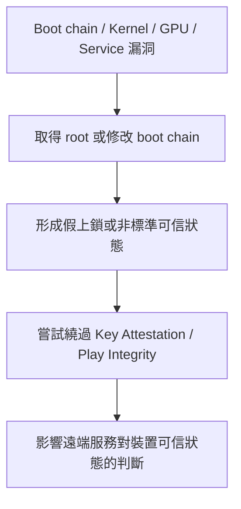

# 近期被利用之「免解鎖 Bootloader 取得 Root」漏洞列表

> 用途：資安研究、風險追蹤與防護評估。
> 
> 注意：請勿用於未經授權的測試或攻擊行為。

## 1. 已知漏洞與攻擊鏈總覽

### 1.1 漏洞 1：CVE-2025-21479（Qualcomm Adreno GPU micronode 記憶體破壞）

此漏洞出現在 Qualcomm Adreno GPU 的 micronode 指令處理流程中；公開描述指出，攻擊者可藉由特定指令序列觸發未授權命令執行與記憶體破壞。公開的 GitHub PoC 為：

- <https://github.com/zhuowei/cheese>
- <https://github.com/sarabpal-dev/cheese-cake>

若漏洞可被成功鏈接到系統提權路徑，可能進一步取得臨時 Root 權限，但實際影響仍會受到 SoC、GPU 世代、韌體版本與修補狀態影響。

社群實測回報（其他機型待驗證）：

- 來源：Coolapk 使用者「@羊了个羊了个羊了个羊」
- 連結：<https://www.coolapk.com/feed/70655251?s=NTFjZmEwYzkyN2NkOGUyZzY5YzYxOTM4ega1601>
- 重點：貼文內容描述在 Redmi Note 12 Turbo（標籤含 `#红米Note12Turbo`）結合 <https://github.com/zhuowei/cheese> 進行測試，回報可達到臨時 Root 相關效果。
- 註記：此為社群單點回報，建議以「可行跡象」歸檔，後續仍需多機型與多版本交叉驗證。

---

### 1.2 漏洞 2：ABL Cmdline Injection（fastboot OEM / ABL 命令列注入漏洞鏈）

此類漏洞鏈的核心在於 Qualcomm ABL（Android Bootloader）對 `fastboot oem` 某些參數的驗證不完整，導致不受信任的輸入被帶入 kernel cmdline。公開討論中，研究者展示了可藉由 OEM 指令額外注入如 `androidboot.selinux=permissive` 之類的啟動參數，進而削弱開機後的強制安全限制。

Qualcomm 對應修補提交也直接將問題描述為：

`Fix propagation of untrusted input into kernel cmdline`

因此，這條鏈本身通常不是最終目的，而是作為後續提權、臨時 Root、甚至免解鎖 Bootloader 操作的前置條件之一。

#### 1.2.1 補充：其他已知利用方式與組合鏈

除了常見的：

```bash
fastboot oem set-gpu-preemption 0 androidboot.selinux=permissive
```

另有相似利用方式：

```bash
fastboot oem set-hw-fence-value 0 androidboot.selinux=permissive
```

這類問題的核心相同，都是原本只應接受數值參數的 `fastboot oem` 指令，卻可能將額外輸入內容帶入 kernel cmdline，進而注入 `androidboot.selinux=permissive`，使系統於開機後進入 **SELinux permissive** 狀態，而非 enforcing。

已知情況如下：

- `set-gpu-preemption` 這一路徑可用於關閉 SELinux 強制執行，屬於 **Qualcomm 限定**，目前已存在修補提交。
- `set-hw-fence-value` 為另一個相似變體，亦已修補；公開討論中指出此類問題屬於較早期引入的老漏洞，理論上可能適用於更多 Qualcomm SoC。
- 版本分佈觀察（社群回報）：目前較多可利用回報集中在 **HyperOS 2 / HyperOS 3**；其他版本仍需更多樣本與獨立驗證。

此外，在 **Xiaomi 裝置** 上，公開討論中亦提到可配合使用下列系統服務呼叫：

```bash
service call miui.mqsas.IMQSNative 21 i32 1 s16 "命令" i32 1 s16 "参数列表" s16 "输出路径" i32 600
```

其重點在於：若可成功呼叫對應服務介面，可能以 **root 權限執行任意命令**。

不過，這裡的順序很重要：必須先透過 Qualcomm ABL cmdline injection 將系統切至 `SELinux permissive`，之後才有機會配合 Xiaomi `IMQSNative` / `MQSAS` 相關問題形成後續提權鏈。

此類利用鏈大致可整理為：

1. 先透過 ABL 類漏洞注入 `androidboot.selinux=permissive`
2. 使系統以 **SELinux permissive** 狀態啟動
3. 再呼叫 Xiaomi 系統服務 `miui.mqsas.IMQSNative`
4. 進一步取得 **root 身份任意命令執行**

在此情況下，可形成 **完整 root 權限取得**。

另外，公開討論中也提到：
對於已經處於 **SELinux permissive** 的系統，即使不是 Xiaomi 裝置，也可能存在其他提權方式，例如利用 isolated service / isolated process 相關技巧進一步提權。

參考資料：

- `set-gpu-preemption` 修補提交：
  <https://git.codelinaro.org/clo/la/abl/tianocore/edk2/-/commit/fb8e864254cdc370670233e3cb73a2b18ff33c9f>

- `set-hw-fence-value` 修補提交：
  <https://git.codelinaro.org/clo/la/abl/tianocore/edk2/-/commit/78297e8cfe091fc59c42fc33d3490e2008910fe2>

- Magica：
  <https://github.com/vvb2060/Magica>

- 討論來源：
  <https://t.me/vvb2060_Channel/17>
  <https://t.me/vvb2060_Channel/19>

> 註：
> - `CVE-2025-21479` 為已公開編號之 GPU 漏洞。
> - `ABL Cmdline Injection` 為整理用途的技術性名稱，用來統稱 fastboot OEM / ABL 參數驗證不完整、可導致 kernel cmdline 注入的漏洞鏈。

### 1.3 漏洞 3：GBL / UEFI Secure Boot Chain 類漏洞鏈（gbl_root_canoe）

參考專案：

- <https://github.com/superturtlee/gbl_root_canoe>

`gbl_root_canoe` 是近期針對新一代 Qualcomm 平台公開的 GBL / UEFI / ABL 相關研究專案。  
依照其公開說明，該專案並非單純修改 Android userspace，而是介入 **GBL / UEFI / ABL / efisp** 這一層的啟動鏈流程。

其核心風險可概括為：

- 影響範圍集中於較新的 Qualcomm 平台，尤其是 **Snapdragon 8 Elite Gen 5 / Snapdragon 8 Gen 5** 相關裝置。
- 利用點位於 Android 系統啟動前的 boot chain 階段。
- 可能透過替換、修補或重新封裝啟動鏈元件，改變裝置的啟動狀態、驗證流程或 fastboot 行為。
- 部分公開說明提到 `lockmode` / `unlockmode` 設計，顯示此類工具可能具備讓裝置在特定情境下呈現類似「假上鎖」狀態的能力。
- 此類漏洞鏈與傳統 Android userspace 提權不同，風險層級更接近 **bootloader / secure boot chain bypass**。

目前公開資料中提到的可能受影響平台，整理於 3.4「待驗證裝置」。

> 註：  
> 此處的「可能受影響」應理解為公開專案或社群研究中提到的觀察範圍，不代表每一台裝置、每一個韌體版本都已確認可利用。

---

### 1.4 漏洞 4：MTK Preloader 類漏洞鏈（OPPO / Realme / OnePlus）

參考專案：

- <https://github.com/Shocked-Cat/oppo-mtk-fastboot-unlock>

此類研究主要針對 **MediaTek 平台**，尤其是 OPPO / Realme / OnePlus 等 OPlus 系列裝置。  
公開專案描述指出，其核心方向是修改 factory preloader，並透過 mtkclient 寫入 preloader，以開啟 fastboot 存取或進一步解鎖 Bootloader。

其核心風險可概括為：

- 攻擊面位於 **MediaTek boot chain / preloader** 階段。
- 不是 Android userspace 層級漏洞。
- 可能透過修改 preloader 行為，改變裝置是否能進入 fastboot、是否能進一步執行解鎖流程。
- 在部分裝置上，解鎖或修改 boot chain 後可能造成 secure boot 狀態改變。
- 是否能達成免解鎖 Bootloader Root，需視裝置是否仍驗證後續映像、AVB / vbmeta 狀態、preloader 加密與廠商客製檢查而定。

> 備註：  
> MTK 裝置的可利用性高度依賴廠商實作。即使同為 MTK SoC，不同品牌、不同 preloader、不同 DA / auth 策略，結果也可能完全不同。

---

### 1.5 漏洞 5：MediaTek Secure Boot Chain bypass（fenrir）

參考專案：

- <https://github.com/R0rt1z2/fenrir>

`fenrir` 是針對 MediaTek secure boot chain 的公開 PoC。  
其 README 描述該漏洞影響 **Nothing Phone (2a)** / **CMF Phone 1**，並可能影響其他 MediaTek 裝置。

公開說明中的重點包含：

- 漏洞位於 **MediaTek secure boot chain**。
- 問題核心是特定條件下，有元件未被正確驗證。
- 該 PoC 可在 Preloader 之後破壞 secure boot chain。
- README 提到可達成 **EL3 code execution**。
- 目前明確支援 Nothing Phone (2a)，CMF Phone 1 則已知可行但支援仍不完整。

- README 亦提到 PoC 中包含 spoof lock state 的能力，用於在裝置實際處於非標準狀態時呈現 locked 狀態。

可能受影響裝置清單整理於 3.2「Nothing / CMF」。

---

### 1.6 漏洞 6：Dirty Pipe（CVE-2022-0847）

Dirty Pipe（CVE-2022-0847）是 Linux kernel 中曾被公開利用的本地提權漏洞。  
此漏洞與 pipe buffer / page cache 寫入行為有關，攻擊者在特定條件下可能修改原本只讀的檔案快取內容，進而造成權限提升。

在 Android 裝置上，Dirty Pipe 曾被研究者用於取得 temporary root / root shell。  
因此，它可以被歸類為「可能直接導向暫時 Root」的漏洞類型，而不是像 ABL Cmdline Injection 那樣只屬於前置條件型漏洞。

參考資料：

- CVE-2022-0847：<https://nvd.nist.gov/vuln/detail/CVE-2022-0847>
- Dirty Pipe 說明：<https://dirtypipe.cm4all.com/>
- Android 相關研究案例：<https://github.com/polygraphene/DirtyPipe-Android>
- Android 相關研究案例：<https://github.com/tiann/DirtyPipeRoot>

## 2. 可能被利用的後續攻擊面

### 2.1 遠端完整性驗證繞過：RKA / RKP / Key Attestation

參考專案：

- <https://github.com/vocolboy/RemoteKeyAttestation>

RKA / RKP 本身並不是用來直接取得 root 權限的漏洞，而是與 Android 裝置信任判斷、Key Attestation、Play Integrity、Remote Key Provisioning 相關的驗證機制與研究方向。

在「免解鎖 Bootloader 取得 Root」或「假上鎖」相關攻擊鏈中，RKA / RKP 比較適合被視為**後續完整性驗證繞過或信任狀態偽裝的攻擊面**，而不是第一階段提權漏洞。

#### 2.1.1 為何與免解鎖 Bootloader Root 有關？

Android 的遠端驗證機制通常會關注裝置是否處於可信狀態，例如：

- Bootloader 是否為 locked
- Verified Boot 狀態是否正常
- 裝置是否使用可信的 boot key
- Key Attestation 是否來自硬體或可信環境
- Play Integrity 是否能取得較高等級結果，例如 `STRONG_INTEGRITY`

因此，如果攻擊者已經透過其他漏洞達成以下狀態：

1. 免解鎖 Bootloader 取得 root
2. Boot chain 被修改但裝置仍呈現 locked
3. 透過 GBL / UEFI / ABL 類漏洞形成假上鎖狀態
4. 在 root 後嘗試隱藏修改痕跡

那麼 RKA / RKP / Key Attestation 相關攻擊就可能被用來處理下一階段問題：

**如何讓遠端服務仍然相信裝置處於可信狀態。**

#### 2.1.2 在攻擊鏈中的位置



#### 2.1.3 風險定位

| 分類 | 內容 |
| --- | --- |
| 類型 | Post-root / Post-bootchain-compromise Integrity Bypass |
| 是否直接取得 root | 否 |
| 是否可能用於免解鎖 Bootloader 攻擊鏈 | 是 |
| 主要用途 | 影響遠端完整性驗證結果 |
| 相關機制 | Key Attestation、RKA、RKP、Play Integrity、STRONG_INTEGRITY |
| 依賴條件 | 通常需要先取得 root、修改 boot chain，或形成假上鎖狀態 |
| 風險重點 | 遠端服務可能被誤導，錯判裝置仍處於可信狀態 |

## 3. 裝置受影響清單

### 3.1 Xiaomi / Redmi / POCO

| codename | 手機型號名稱 | 平台 | Android 版本 | 安全性修補日期 | 漏洞名稱 / CVE | 狀態 | 備註 |
| --- | --- | --- | --- | --- | --- | --- | --- |
| cupid     | Xiaomi 12         | Snapdragon 8 Gen 1    | Android 12 | N/A | CVE-2025-21479 | 未測試 |
| zeus      | Xiaomi 12 Pro     | Snapdragon 8 Gen 1    | Android 12 | N/A | CVE-2025-21479 | 未測試 | 
| mayfly    | Xiaomi 12S        | Snapdragon 8+ Gen 1   | Android 12 | N/A | CVE-2025-21479 | 未測試 |
| unicorn   | Xiaomi 12S Pro    | Snapdragon 8+ Gen 1   | Android 12 | N/A | CVE-2025-21479 | 未測試 |
| thor      | Xiaomi 12S Ultra  | Snapdragon 8+ Gen 1   | Android 12 | N/A | CVE-2025-21479 | 未測試 |
| fuxi      | Xiaomi 13         | Snapdragon 8 Gen 2    | Android 13 | N/A | ABL Cmdline Injection | 未測試 |
| nuwa      | Xiaomi 13 Pro     | Snapdragon 8 Gen 2    | Android 13 | N/A | ABL Cmdline Injection | 未測試 |
| ishtar    | Xiaomi 13 Ultra   | Snapdragon 8 Gen 2    | Android 13 | N/A | ABL Cmdline Injection | 未測試 |
| houji     | Xiaomi 14         | Snapdragon 8 Gen 3    | Android 14 | N/A | ABL Cmdline Injection | 已測試 |
| shennong  | Xiaomi 14 Pro     | Snapdragon 8 Gen 3    | Android 14 | N/A | ABL Cmdline Injection | 未測試 |
| aurora    | Xiaomi 14 Ultra   | Snapdragon 8 Gen 3    | Android 14 | N/A | ABL Cmdline Injection | 未測試 |
| dada      | Xiaomi 15         | Snapdragon 8 Elite    | Android 15 | N/A | ABL Cmdline Injection | 未測試 |
| haotian   | Xiaomi 15 Pro     | Snapdragon 8 Elite    | Android 15 | N/A | ABL Cmdline Injection | 未測試 |
| xuanyuan  | Xiaomi 15 Ultra   | Snapdragon 8 Elite    | Android 15 | N/A | ABL Cmdline Injection | 未測試 |
| pudding   | Xiaomi 17         | Snapdragon 8 Elite Gen 5  | Android 16 | N/A | ABL Cmdline Injection | 未測試 |
| pandora   | Xiaomi 17 Pro     | Snapdragon 8 Elite Gen 5  | Android 16 | N/A | ABL Cmdline Injection | 未測試 |
| popsicle  | Xiaomi 17 Pro Max | Snapdragon 8 Elite Gen 5  | Android 16 | N/A | ABL Cmdline Injection | 未測試 |
| nezha     | Xiaomi 17 Ultra   | Snapdragon 8 Elite Gen 5  | Android 16 | N/A | ABL Cmdline Injection | 未測試 |
| liuqin    | Xiaomi Pad 6 Pro              | Snapdragon 8+ Gen 1   | Android 13 | N/A | CVE-2025-21479 | 未測試 |
| yudi      | Xiaomi Pad 6 Max 14           | Snapdragon 8+ Gen 1   | Android 13 | N/A | CVE-2025-21479 | 未測試 |
| sheng     | Xiaomi Pad 6S Pro 12.4        | Snapdragon 8 Gen 2    | Android 16 | N/A | ABL Cmdline Injection | 未測試 |
| uke       | Xiaomi Pad 7 / POCO Pad X1    | Snapdragon 7+ Gen 3   | Android 16 | N/A | CVE-2025-21479 | 未測試 | 
| muyu      | Xiaomi Pad 7 Pro              | Snapdragon 8s Gen 3   | Android 16 | N/A | ABL Cmdline Injection | 未測試 | 
| yupei     | Xiaomi Pad 8                  | Snapdragon 8s Gen 4   | Android 16 | N/A | ABL Cmdline Injection | 未測試 | 
| piano     | Xiaomi Pad 8 Pro              | Snapdragon 8 Elite    | Android 16 | N/A | ABL Cmdline Injection | 未測試 | 
| ruyi      | Xiaomi MIX Flip               | Snapdragon 8 Gen 3    | Android 14 | N/A | ABL Cmdline Injection | 未測試 |
| bixi      | Xiaomi MIX Flip 2             | Snapdragon 8 Elite    | Android 15 | N/A | ABL Cmdline Injection | 未測試 |
| babylon   | Xiaomi MIX Fold 3             | Snapdragon 8 Gen 2    | Android 13 | N/A | ABL Cmdline Injection | 未測試 |
| goku      | Xiaomi MIX Fold 4             | Snapdragon 8 Gen 3    | Android 14 | N/A | ABL Cmdline Injection | 未測試 |
| marble    | Redmi Note 12 Turbo / POCO F5     | Snapdragon 7+ Gen 2   | Android 13 | 2026-02-01 | CVE-2025-21479 | 已測試 |
| ingres    | Redmi K50 Gaming / POCO F4 GT     | Snapdragon 8 Gen 1    | Android 12 | 2025-04-01 | CVE-2025-21479 | 已測試未成功 |
| diting    | Redmi K50 Ultra / Xiaomi 12T Pro  | Snapdragon 8+ Gen 1   | Android 12 | N/A | CVE-2025-21479 | 未測試 |
| mondrian  | Redmi K60 / POCO F5 Pro           | Snapdragon 8+ Gen 1   | Android 13 | N/A | CVE-2025-21479 | 未測試 |
| socrates  | Redmi K60 Pro                     | Snapdragon 8 Gen 2    | Android 13 | N/A | ABL Cmdline Injection | 未測試 |
| vermeer   | Redmi K70 / POCO F6 Pro           | Snapdragon 8 Gen 2    | Android 14 | N/A | ABL Cmdline Injection | 未測試 |
| manet     | Redmi K70 Pro                     | Snapdragon 8 Gen 3    | Android 14 | N/A | ABL Cmdline Injection | 未測試 |
| zorn      | Redmi K80 / POCO F7 Pro           | Snapdragon 8 Gen 3    | Android 15 | N/A | ABL Cmdline Injection | 未測試 |
| miro      | Redmi K80 Pro / POCO F7 Ultra     | Snapdragon 8 Elite    | Android 15 | N/A | ABL Cmdline Injection | 未測試 |
| annibale  | Redmi K90 / POCO F8 Pro           | Snapdragon 8 Elite    | Android 16 | N/A | ABL Cmdline Injection | 未測試 |
| myron     | Redmi K90 Pro Max / POCO F8 Ultra | Snapdragon 8 Elite Gen 5 | Android 16 | N/A | ABL Cmdline Injection | 未測試 |

### 3.2 Nothing / CMF

| codename | 裝置 | 平台 | 狀態 | 備註 |
| --- | --- | --- | --- | --- |
| Pacman | Nothing Phone (2a) | MediaTek | 已公開支援 | fenrir README 明確列出 |
| Tetris | CMF Phone 1 | MediaTek | 已知可行，支援不完整 | fenrir README 明確提到 |
| PacmanPro | Nothing Phone (2a) Plus | MediaTek | release 中出現 | 需進一步驗證 |
| N/A | Vivo X80 Pro | MediaTek | 研究者提及可能受影響 | 需獨立驗證 |

### 3.3 OPPO / Realme / OnePlus

- 待補充。

### 3.4 待驗證裝置

以下為公開資料/專案提及但尚未獨立驗證之清單（來源見 1.3）：

- Xiaomi 17 series
- Redmi K90 Pro Max
- OnePlus 15 / Ace 6T
- RedMagic 11 series
- Nubia Z80 Ultra
