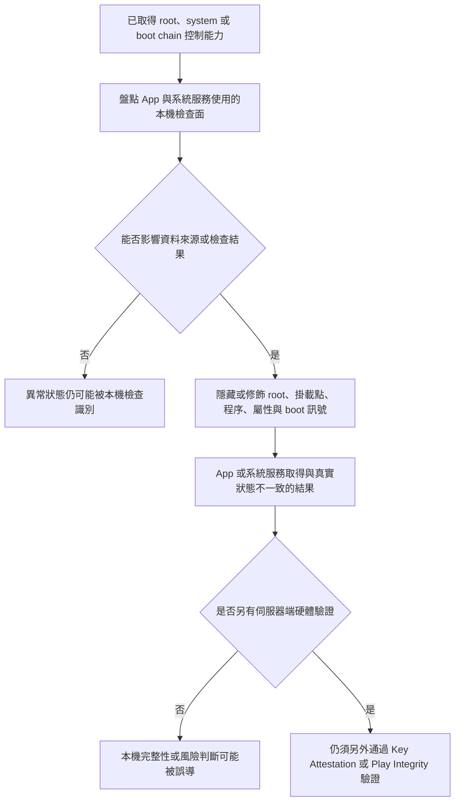
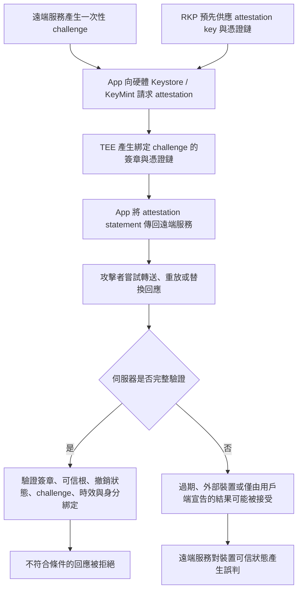
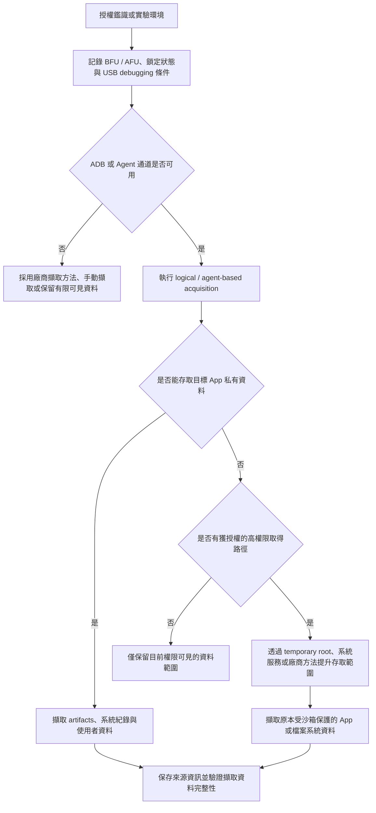
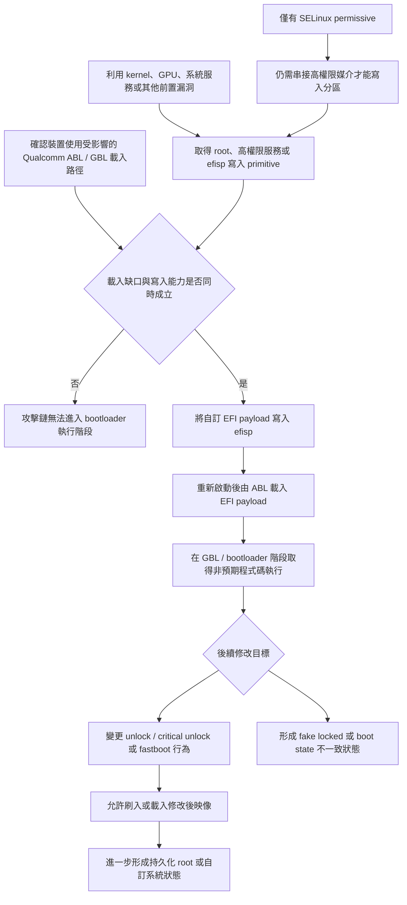
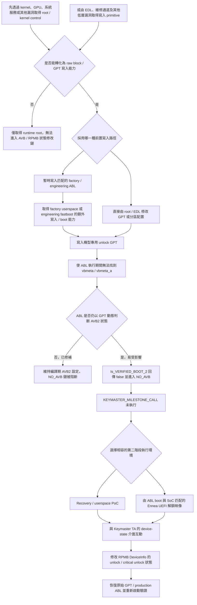
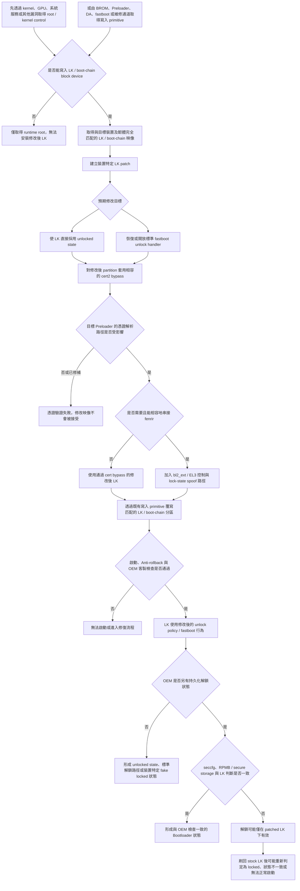
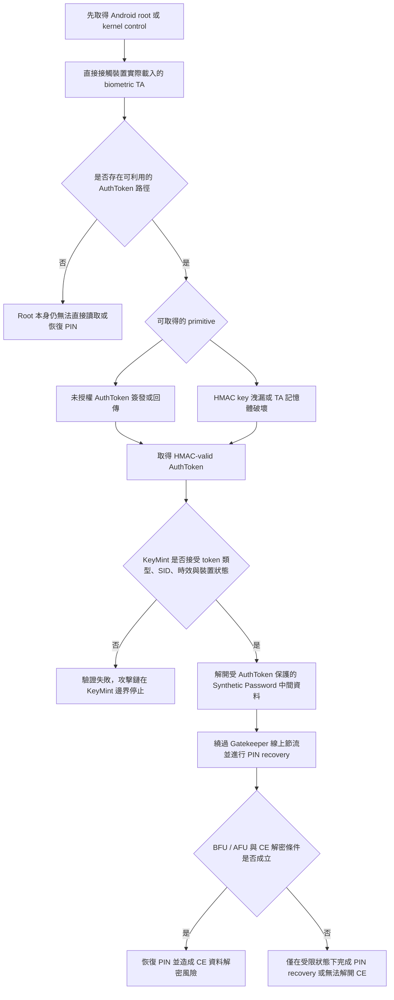

# 近期被利用之「免解鎖 Bootloader 取得 Root」漏洞列表

> 用途：資安研究、風險追蹤與防護評估。
> 
> 注意：請勿用於未經授權的測試或攻擊行為。

## 1. 已知漏洞與攻擊鏈總覽

### 1.1 漏洞 1：CVE-2025-21479（Qualcomm Adreno GPU micronode 記憶體破壞）

此漏洞出現在 Qualcomm Adreno GPU 的 micronode 指令處理流程中；公開描述指出，攻擊者可藉由特定指令序列觸發未授權命令執行與記憶體破壞。公開的 GitHub PoC 為：

- <https://github.com/zhuowei/cheese>
- <https://github.com/sarabpal-dev/cheese-cake>

若漏洞可被成功鏈接到系統提權路徑，可能進一步取得臨時 Root 權限，但實際影響仍會受到 SoC、GPU 世代、韌體版本與修補狀態影響。

在本報告的攻擊鏈整理中，CVE-2025-21479 與後述 ABL Cmdline Injection 的共同點，是它們都可能被用作**削弱 SELinux enforcing 限制**或使系統進入 **SELinux permissive** 狀態的前置入口。  
一旦 SELinux 強制存取控制失效，後續就可能接上其他本機提權技巧，例如 Xiaomi `IMQSNative` / `MQSAS` 服務呼叫，或 Magica 所代表的 isolated service / isolated process 類提權路徑。

社群實測回報（其他機型待驗證）：

- 來源：Coolapk 使用者「@羊了个羊了个羊了个羊」
- 連結：<https://www.coolapk.com/feed/70655251?s=NTFjZmEwYzkyN2NkOGUyZzY5YzYxOTM4ega1601>
- 重點：貼文內容描述在 Redmi Note 12 Turbo（標籤含 `#红米Note12Turbo`）結合 <https://github.com/zhuowei/cheese> 進行測試，回報可達到臨時 Root 相關效果。
- 註記：此為社群單點回報，建議以「可行跡象」歸檔，後續仍需多機型與多版本交叉驗證。

---

### 1.2 漏洞 2：ABL Cmdline Injection（fastboot OEM / ABL 命令列注入漏洞鏈）

此類漏洞鏈的核心在於 Qualcomm ABL（Android Bootloader）對 `fastboot oem` 某些參數的驗證不完整，導致不受信任的輸入被帶入 kernel cmdline。公開討論中，研究者展示了可藉由 OEM 指令額外注入如 `androidboot.selinux=permissive` 之類的啟動參數，進而削弱開機後的強制安全限制。

Qualcomm 對應修補提交也直接將問題描述為：

`Fix propagation of untrusted input into kernel cmdline`

因此，這條鏈本身通常不是最終目的，而是作為後續提權、臨時 Root、甚至免解鎖 Bootloader 操作的前置條件之一。

#### 1.2.1 補充：其他已知利用方式與組合鏈

除了常見的：

```bash
fastboot oem set-gpu-preemption 0 androidboot.selinux=permissive
```

另有相似利用方式：

```bash
fastboot oem set-hw-fence-value 0 androidboot.selinux=permissive
```

這類問題的核心相同，都是原本只應接受數值參數的 `fastboot oem` 指令，卻可能將額外輸入內容帶入 kernel cmdline，進而注入 `androidboot.selinux=permissive`，使系統於開機後進入 **SELinux permissive** 狀態，而非 enforcing。

已知情況如下：

- `set-gpu-preemption` 這一路徑可用於關閉 SELinux 強制執行，屬於 **Qualcomm 限定**，目前已存在修補提交。
- `set-hw-fence-value` 為另一個相似變體，亦已修補；公開討論中指出此類問題屬於較早期引入的老漏洞，理論上可能適用於更多 Qualcomm SoC。
- 版本分佈觀察（社群回報）：目前較多可利用回報集中在 **HyperOS 2 / HyperOS 3**；其他版本仍需更多樣本與獨立驗證。

此外，在 **Xiaomi 裝置** 上，公開討論中亦提到可配合使用下列系統服務呼叫：

```bash
service call miui.mqsas.IMQSNative 21 i32 1 s16 "命令" i32 1 s16 "参数列表" s16 "输出路径" i32 600
```

其重點在於：若可成功呼叫對應服務介面，可能以 **root 權限執行任意命令**。

不過，這裡的順序很重要：必須先透過 CVE-2025-21479、Qualcomm ABL cmdline injection，或其他方式使 SELinux enforcing 失效 / 進入 `SELinux permissive`，之後才有機會配合後續本機提權技巧形成完整鏈。

目前公開討論中較常被提到的後續路徑包含兩類：

1. **Xiaomi `IMQSNative` / `MQSAS` 服務路徑**：在 SELinux permissive 後，若可呼叫對應系統服務介面，可能以 root 權限執行命令。
2. **Magica / isolated service 路徑**：Magica README 將其描述為 Android 10+ 在 seccomp disabled 情境下的 privilege escalation PoC；公開討論亦提到，SELinux permissive 後可利用 isolated service / isolated process 類技巧進一步提權。

以 Xiaomi `IMQSNative` / `MQSAS` 為例，利用鏈大致可整理為：

1. 先透過 ABL 類漏洞注入 `androidboot.selinux=permissive`
2. 使系統以 **SELinux permissive** 狀態啟動
3. 再呼叫 Xiaomi 系統服務 `miui.mqsas.IMQSNative`
4. 進一步取得 **root 身份任意命令執行**

在此情況下，可形成 **完整 root 權限取得**。

若採用 Magica / isolated service 類路徑，則重點不在於特定 Xiaomi 服務，而是在 **SELinux permissive** 或其他安全限制被削弱後，利用 isolated service / isolated process 執行環境與系統服務邊界形成後續提權。  
因此，1.1 與 1.2 可視為「讓 SELinux 限制失效」的前置入口；`IMQSNative` 與 Magica 則是 permissive 之後可能銜接的不同提權分支。

參考資料：

- `set-gpu-preemption` 修補提交：
  <https://git.codelinaro.org/clo/la/abl/tianocore/edk2/-/commit/fb8e864254cdc370670233e3cb73a2b18ff33c9f>

- `set-hw-fence-value` 修補提交：
  <https://git.codelinaro.org/clo/la/abl/tianocore/edk2/-/commit/78297e8cfe091fc59c42fc33d3490e2008910fe2>

- Magica：
  <https://github.com/vvb2060/Magica>

- 討論來源：
  <https://t.me/vvb2060_Channel/17>
  <https://t.me/vvb2060_Channel/19>

> 註：
> - `ABL Cmdline Injection` 為整理用途的技術性名稱，用來統稱 fastboot OEM / ABL 參數驗證不完整、可導致 kernel cmdline 注入的漏洞鏈。
> - 小米已在 2026 年 2 月安全修補補丁中修補了相關問題

### 1.3 漏洞 3：GBL / UEFI Secure Boot Chain 類漏洞鏈（gbl_root_canoe）

參考專案：

- <https://github.com/superturtlee/gbl_root_canoe>

`gbl_root_canoe` 是近期針對新一代 Qualcomm 平台公開的 GBL / UEFI / ABL 相關研究專案。  
依照其公開說明，該專案並非單純修改 Android userspace，而是介入 **GBL / UEFI / ABL / efisp** 這一層的啟動鏈流程。

其核心風險可概括為：

- 影響範圍集中於較新的 Qualcomm 平台，尤其是 **Snapdragon 8 Elite Gen 5 / Snapdragon 8 Gen 5** 相關裝置。
- 利用點位於 Android 系統啟動前的 boot chain 階段。
- 可能透過替換、修補或重新封裝啟動鏈元件，改變裝置的啟動狀態、驗證流程或 fastboot 行為。
- 部分公開說明提到 `lockmode` / `unlockmode` 設計，顯示此類工具可能具備讓裝置在特定情境下呈現類似「假上鎖」狀態的能力。
- 此類漏洞鏈與傳統 Android userspace 提權不同，風險層級更接近 **bootloader / secure boot chain bypass**。

目前公開資料中提到的可能受影響平台，整理於 3.4「待驗證裝置」。

> 註：  
> 此處的「可能受影響」應理解為公開專案或社群研究中提到的觀察範圍，不代表每一台裝置、每一個韌體版本都已確認可利用。

---

### 1.4 漏洞 4：MTK Preloader 類漏洞鏈（OPPO / Realme / OnePlus）

參考專案：

- <https://github.com/Shocked-Cat/oppo-mtk-fastboot-unlock>

此類研究主要針對 **MediaTek 平台**，尤其是 OPPO / Realme / OnePlus 等 OPlus 系列裝置。  
公開專案描述指出，其核心方向是修改 factory preloader，並透過 mtkclient 寫入 preloader，以開啟 fastboot 存取或進一步解鎖 Bootloader。

其核心風險可概括為：

- 攻擊面位於 **MediaTek boot chain / preloader** 階段。
- 不是 Android userspace 層級漏洞。
- 可能透過修改 preloader 行為，改變裝置是否能進入 fastboot、是否能進一步執行解鎖流程。
- 在部分裝置上，解鎖或修改 boot chain 後可能造成 secure boot 狀態改變。
- 是否能達成免解鎖 Bootloader Root，需視裝置是否仍驗證後續映像、AVB / vbmeta 狀態、preloader 加密與廠商客製檢查而定。

> 註：  
> - MTK 裝置的可利用性高度依賴廠商實作。即使同為 MTK SoC，不同品牌、不同 preloader、不同 DA / auth 策略，結果也可能完全不同。
> - 已知 OPPO / Realme / OnePlus 的部分 MTK 裝置已在安全補丁 2025 年 Android 13 以上設備加密 DA，加密後僅可使用售後授權工具或是降級系統版本方式利用此類漏洞鏈。

---

### 1.5 漏洞 5：MediaTek Secure Boot Chain bypass（fenrir）

參考專案：

- <https://github.com/R0rt1z2/fenrir>

`fenrir` 是針對 MediaTek secure boot chain 的公開 PoC。  
專案最初以 **Nothing Phone (2a)** / **CMF Phone 1** 為主要目標，目前上游 README 已將支援範圍擴展至 Nothing、CMF、Lenovo、Tecno、Zinwa、Redmi 與 POCO 的多款 MediaTek 裝置。

公開說明中的重點包含：

- 漏洞位於 **MediaTek secure boot chain**。
- 問題核心是特定條件下，有元件未被正確驗證。
- 該 PoC 可在 Preloader 之後破壞 secure boot chain。
- README 提到可達成 **EL3 code execution**。
- README 亦提到 PoC 中包含 spoof lock state 的能力，用於在裝置實際處於非標準狀態時呈現 locked 狀態。
- 上游目前列出 12 個受支援的裝置代號；但「列為支援」不代表每個區域版本、OTA 或韌體建置均已完成獨立實機驗證。
- 官方 Releases 頁面目前可見的預先建置資產集中於 `Pacman` 與 `PacmanPro`；其他裝置仍可能需要依對應韌體自行建置或適配。
- Vivo X80 Pro 被作者列為已知受影響，但尚未列入目前正式支援清單。

完整支援狀態與裝置清單整理於 3.2「fenrir 支援與已知受影響裝置」。

---

### 1.6 漏洞 6：Dirty Pipe（CVE-2022-0847）

Dirty Pipe（CVE-2022-0847）是 Linux kernel 中曾被公開利用的本地提權漏洞。  
此漏洞與 pipe buffer / page cache 寫入行為有關，攻擊者在特定條件下可能修改原本只讀的檔案快取內容，進而造成權限提升。

參考資料：

- CVE-2022-0847：<https://nvd.nist.gov/vuln/detail/CVE-2022-0847>
- Dirty Pipe 說明：<https://dirtypipe.cm4all.com/>
- Android 相關研究案例：<https://github.com/polygraphene/DirtyPipe-Android>
- Android 相關研究案例：<https://github.com/tiann/DirtyPipeRoot>

### 1.7 漏洞 7：GhostLock（CVE-2026-43499）

GhostLock 是 Linux kernel `rtmutex` / `futex_requeue()` 路徑中的 Use-After-Free 本地提權漏洞。
問題出現在 proxy-lock rollback 流程：`remove_waiter()` 在特定情況下錯誤操作 `current`，而不是實際的 `waiter::task`，可能留下未清除的 `pi_blocked_on` dangling pointer，進而形成可被利用的 UAF。

此漏洞已從 Linux 完整 exploit 進展到 Android 實機適配階段。公開專案中，NebuSec / CyberMeowfia 同時提供觸發 PoC 與 exploit 實作；後續亦出現針對 Android 16、Xiaomi 17 系列，以及 Samsung Galaxy 特定韌體的移植與工具鏈。

#### 1.7.1 Android 影響評估

- Android 常見的 Linux 5.10、6.1、6.6 與 6.12 分支都可能因實際程式碼與 backport 狀態而受到影響。
- NVD 列出的已修補穩定分支邊界包含 `6.1.175`、`6.6.140`、`6.12.86`、`6.18.27` 與 `7.0.4`；OEM kernel 可能提前回補等效修正，因此不能只依版本字串判定。
- 已有 Xiaomi 17 Pro Max（`popsicle`，Android 16 / kernel 6.12）公開實機適配；其他專案則提供依 `boot.img`、kernel layout 與裝置 profile 產生特定 payload 的框架。
- 此漏洞可作為 temporary root、kernel control 或後續 LKM root 的第一階段，但本身不等於解鎖 Bootloader、繞過 AVB 或取得持久化 root。

#### 1.7.2 公開狀態

| 項目 | 狀態 |
| --- | --- |
| 漏洞類型 | Linux Kernel UAF / Local Privilege Escalation |
| Linux exploit | 已公開 |
| Android 實機適配 | 已公開，包含 Xiaomi 與 Samsung 特定韌體案例 |
| 是否通用 | 否，需精準匹配 kernel、韌體、layout 與 profile |
| 是否可直接解鎖 Bootloader | 否 |
| 報告定位 | Kernel LPE / Temporary Root / Android 高優先追蹤 |

參考資料：

- NVD：<https://nvd.nist.gov/vuln/detail/CVE-2026-43499>
- 原始公開 exploit：<https://github.com/NebuSec/CyberMeowfia/tree/main/IonStack/CVE-2026-43499/exploit>
- Xiaomi 17 系列 Android 適配：<https://github.com/x-spy/CVE-2026-43499-popsicle>
- Android arm64 適配框架：<https://github.com/Linuxoid-cn/CVE-2026-43499-Poc-Analysis>
- Samsung Galaxy 適配工具鏈：<https://github.com/BuSung-dev/Root-My-Galaxy>

### 1.8 漏洞 8：Bad Epoll（CVE-2026-46242）

Bad Epoll 是 Linux kernel `epoll` / `eventpoll` 子系統中的 race-condition Use-After-Free。
公開研究顯示，低權限本機程序可在受影響的 Linux kernel 上將此 UAF 發展為 kernel local privilege escalation；漏洞由 commit `58c9b016e128` 引入，並於 commit `a6dc643c6931` 修補。

#### 1.8.1 Android 影響評估

- 漏洞自 Linux v6.4 引入，因此使用 6.6、6.12 等較新 kernel 基線且尚未回補修正的 Android 裝置屬於候選範圍。
- 作者已在 Pixel 10 的 v6.6+ kernel 上觸發 UAF，但截至公開說明所載，完整 Android root exploit 仍在開發中。
- Pixel 8 與其他以原始 v6.1 為基線、且未回補引入 commit 的裝置不受此上游漏洞影響。
- OEM 可能選擇性 backport 引入或修補，因此最終仍須比對實際 kernel source、commit 與韌體版本，不能僅依 Android 版本或 `uname -r` 判定。

#### 1.8.2 公開狀態

| 項目 | 狀態 |
| --- | --- |
| 漏洞類型 | Linux Kernel epoll UAF / Local Privilege Escalation |
| Linux exploit | 已公開，kernelCTF 目標已有完整利用鏈 |
| Android trigger | 已公開確認可在 Pixel 10 v6.6+ 觸發 UAF |
| Android 完整 root exploit | 尚未公開完成 |
| 是否直接解鎖 Bootloader | 否 |
| 報告定位 | Kernel LPE / Android 高優先待驗證 |

參考資料：

- Bad Epoll 研究與 PoC：<https://github.com/J-jaeyoung/bad-epoll>
- NVD：<https://nvd.nist.gov/vuln/detail/CVE-2026-46242>
- oss-security 公告：<https://www.openwall.com/lists/oss-security/2026/07/08/13>

### 1.9 漏洞 9：CVE-2026-21385（Qualcomm Display / Graphics 記憶體破壞）

CVE-2026-21385 是 Qualcomm Display / Graphics 元件在處理記憶體配置 alignment 時可能發生的 integer overflow / memory corruption。
Qualcomm 給出的 CVSS v3.1 分數為 7.8（High），攻擊向量為本機、低權限、無需使用者互動；Android 2026 年 3 月安全公告將其列為 Qualcomm Display 高風險漏洞。

此漏洞的重要性在於 Android 官方公告指出已有 **limited, targeted exploitation** 跡象，且 CISA 已將其納入 Known Exploited Vulnerabilities（KEV）目錄。這表示它不只是理論上的記憶體破壞問題，而是需要優先追蹤裝置修補狀態的已知利用風險。

#### 1.9.1 Android 影響評估

- 影響範圍應以 Qualcomm 公告中的受影響 chipset、OEM 韌體與實際安全修補內容為準，不能直接推論所有 Qualcomm / Adreno 裝置皆可利用。
- 公開 trigger、crash 或「已造成 overflow」只代表漏洞路徑可能可達，不等於已取得可控記憶體破壞，也不等於存在公開的 Android root exploit。
- 截至本次整理，尚未確認有可跨裝置重現的完整公開 Android root PoC。
- 若能在特定裝置上形成穩定 exploit primitive，可能作為 app-to-kernel、temporary root 或其他漏洞鏈的前置階段；但它本身不直接解鎖 Bootloader。

#### 1.9.2 公開狀態

| 項目 | 狀態 |
| --- | --- |
| 漏洞類型 | Qualcomm Display / Graphics Memory Corruption |
| 官方嚴重度 | High（CVSS 7.8） |
| 已知利用狀態 | Android 公告指出有限、目標式利用；已列入 CISA KEV |
| 公開完整 Android root PoC | 未確認 |
| 是否直接解鎖 Bootloader | 否 |
| 報告定位 | Qualcomm Graphics 攻擊面 / 已知遭利用 / 極高優先追蹤 |

參考資料：

- Android Security Bulletin（2026-03）：<https://source.android.com/docs/security/bulletin/2026/2026-03-01>
- Qualcomm March 2026 Security Bulletin：<https://docs.qualcomm.com/product/publicresources/securitybulletin/march-2026-bulletin.html>
- NVD：<https://nvd.nist.gov/vuln/detail/CVE-2026-21385>

## 2. 可能被利用的後續攻擊手法

本節整理的是公開研究中常被搭配討論的攻擊手法。  
這些手法可以出現在不同階段：裝置端狀態被改變時、本機 App 或系統服務進行檢查時、網路驗證流程傳輸時，或遠端服務判斷裝置可信狀態時。

整理重點放在：

- 攻擊手法作用在哪一層
- 主要想繞過或干擾什麼判斷
- 常見需要搭配哪些條件
- 對裝置、App 或遠端服務可能造成什麼影響

> 流程圖閱讀方式：各小節代表不同攻擊面，並非必然依照 `2.1` 到 `2.7` 串成同一條漏洞鏈；菱形節點用來表示必要條件、修補狀態或信任邊界，任一條件不成立都可能使該路徑停止。

其中 `2.5` 與 `2.6` 特別描述 **post-root boot-chain manipulation**：先由其他漏洞取得 root / kernel control，再將該權限轉化為 GPT、LK 或其他 boot-chain 分區的寫入能力，以進一步影響 Bootloader 狀態。兩節不是用來說明第一階段如何取得 root。

### 2.1 本機繞過：裝置端信任狀態偽裝

本機繞過指的是攻擊者已經在裝置端取得足夠控制能力後，嘗試改變或隱藏本機可觀察到的狀態，使 App、系統服務或完整性檢查元件無法正確判斷裝置是否已被修改。

常見被關注的判斷面包含：

- Bootloader 是否為 locked
- Verified Boot / AVB 狀態是否正常
- 裝置是否使用可信 boot key
- SELinux 是否仍為 enforcing
- 是否存在 root、注入框架、可疑掛載點或被修改的系統屬性
- Key Attestation / Play Integrity 回傳結果是否與真實裝置狀態一致

本機繞過的重點在於讓裝置端檢查結果與真實狀態產生落差。例如：裝置實際已被修改，但 App 或系統服務仍看到接近正常、上鎖或可信的狀態。

#### 2.1.1 流程示意


```mermaid
flowchart TD
    A["已取得 root、system 或 boot chain 控制能力"] --> B["盤點 App 與系統服務使用的本機檢查面"]
    B --> C{"能否影響資料來源或檢查結果"}
    C -->|"否"| D["異常狀態仍可能被本機檢查識別"]
    C -->|"是"| E["隱藏或修飾 root、掛載點、程序、屬性與 boot 訊號"]
    E --> F["App 或系統服務取得與真實狀態不一致的結果"]
    F --> G{"是否另有伺服器端硬體驗證"}
    G -->|"否"| H["本機完整性或風險判斷可能被誤導"]
    G -->|"是"| I["仍須另外通過 Key Attestation 或 Play Integrity 驗證"]
```

#### 2.1.2 風險定位

| 分類 | 內容 |
| --- | --- |
| 類型 | Post-root / Post-bootchain-compromise Local Bypass |
| 攻擊位置 | 裝置本機、App 檢查流程、系統服務回傳結果 |
| 主要用途 | 偽裝本機裝置狀態、降低 App 或系統服務偵測機率 |
| 相關機制 | Boot state、AVB、SELinux、系統屬性、root 偵測、Key Attestation / Play Integrity 本機呼叫結果 |
| 常見前提 | 已能影響本機檢查流程、系統屬性、回傳結果或執行環境 |
| 風險重點 | 本機檢查可能被誤導，錯判裝置仍處於可信或未修改狀態 |

### 2.2 中間人 / 轉送攻擊：Key Attestation 驗證流程干擾

參考專案：

- <https://github.com/vocolboy/RemoteKeyAttestation>

> 定位說明：上述專案是 RKA / RKP 與 Play Integrity 的研究及示範，不是「任意網路中間人都能竄改硬體 attestation」的通用 PoC。RKA / RKP 是金鑰與憑證供應機制；真正的攻擊面在於驗證結果被轉送、替換或重放時，伺服器端是否完整驗證簽章、challenge、憑證鏈、撤銷狀態與請求綁定。

此類研究重點在於 Remote Key Attestation / Key Attestation 驗證流程中的信任邊界。  
攻擊者可能嘗試介入 App、驗證服務與 attestation 結果之間的傳輸或處理流程，使驗證方收到被替換、重放、轉發或不符合原始裝置狀態的結果。

在這類情境中，風險重點在於驗證流程是否完整綁定：

- challenge / nonce 是否不可重放
- 回傳結果是否與當次請求、帳號、裝置與 App 身分綁定
- 憑證鏈與硬體信任來源是否被正確驗證
- App 與遠端服務之間的傳輸與回應是否可被插入或替換
- 驗證服務是否只相信用戶端回報，而沒有在伺服器端重新驗證 attestation statement

因此，中間人攻擊應被視為「驗證流程層」的問題。它的重點是干擾或誤導遠端驗證結果，使服務端對裝置可信狀態產生錯誤判斷。

#### 2.2.1 流程示意


```mermaid
flowchart TD
    A["遠端服務產生一次性 challenge"] --> B["App 向硬體 Keystore / KeyMint 請求 attestation"]
    R["RKP 預先供應 attestation key 與憑證鏈"] --> B
    B --> C["TEE 產生綁定 challenge 的簽章與憑證鏈"]
    C --> D["App 將 attestation statement 傳回遠端服務"]
    D --> E["攻擊者嘗試轉送、重放或替換回應"]
    E --> F{"伺服器是否完整驗證"}
    F -->|"是"| G["驗證簽章、可信根、撤銷狀態、challenge、時效與身分綁定"]
    G --> H["不符合條件的回應被拒絕"]
    F -->|"否"| I["過期、外部裝置或僅由用戶端宣告的結果可能被接受"]
    I --> J["遠端服務對裝置可信狀態產生誤判"]
```

#### 2.2.2 風險定位

| 分類 | 內容 |
| --- | --- |
| 類型 | Attestation Relay / Response Substitution / Verification Bypass |
| 攻擊位置 | App 與遠端驗證服務之間的請求、回應或資料處理流程 |
| 主要用途 | 干擾遠端完整性驗證流程，影響服務端對裝置可信狀態的判斷 |
| 相關機制 | Remote Key Attestation、Key Attestation、RKP、Play Integrity、challenge / nonce、憑證鏈驗證 |
| 常見前提 | 伺服器未完整驗證簽章、challenge、時效、憑證鏈、撤銷狀態，或未綁定裝置、App、帳號與當次請求 |
| 風險重點 | 遠端服務可能被中間人流程誤導，錯判裝置仍處於可信狀態 |

### 2.3 ADB / Agent 輔助取證：應用程式資料取得

行動裝置鑑識常見目標之一，是在合法授權或實驗環境下取得應用程式資料、系統紀錄、媒體檔案、帳號痕跡、通訊紀錄與其他可供分析的 artifacts。  
Android 官方文件將 ADB 定位為可與裝置通訊、安裝與除錯應用程式、取得 Unix shell 的命令列工具；因此在鑑識流程中，ADB 常被作為裝置連線、邏輯擷取、代理程式部署或資料匯出的基礎通道。

此類手法的核心限制在於 Android 的應用程式沙箱與儲存隔離。  
Android 官方文件指出，App 的 internal storage 預設不允許其他 App 存取，且 Android 10 以上這些位置會加密；這使得一般 ADB、MTP 或未提權代理程式通常只能取得部分使用者資料、外部儲存資料、媒體檔、可匯出的 App 資料或畫面/互動層資料。

因此，部分鑑識工具會依裝置狀態與授權範圍，採用不同層級的取得方式，例如：

- 標準 ADB 或 agent-based backup
- 安裝輔助 App 進行 logical extraction
- 對已 root 裝置進行 logical / physical backup
- 針對特定 SoC 或廠商實作的 dump / acquisition method
- 在無法取得檔案系統資料時，改用畫面擷取、手動擷取或 App 支援的匯出能力

在風險分類上，ADB / Agent 輔助取證不一定代表漏洞利用；但如果搭配 ADB 提權漏洞、系統服務漏洞、SELinux 繞過或 boot chain 狀態改變，就可能從「一般邏輯擷取」提升為「可存取私有 App 資料或更完整檔案系統資料」的取證路徑。

#### 2.3.1 流程示意


```mermaid
flowchart TD
    A["授權鑑識或實驗環境"] --> B["記錄 BFU / AFU、鎖定狀態與 USB debugging 條件"]
    B --> C{"ADB 或 Agent 通道是否可用"}
    C -->|"否"| D["採用廠商擷取方法、手動擷取或保留有限可見資料"]
    C -->|"是"| E["執行 logical / agent-based acquisition"]
    E --> F{"是否能存取目標 App 私有資料"}
    F -->|"是"| G["擷取 artifacts、系統紀錄與使用者資料"]
    F -->|"否"| H{"是否有獲授權的高權限取得路徑"}
    H -->|"否"| I["僅保留目前權限可見的資料範圍"]
    H -->|"是"| J["透過 temporary root、系統服務或廠商方法提升存取範圍"]
    J --> K["擷取原本受沙箱保護的 App 或檔案系統資料"]
    G --> L["保存來源資訊並驗證擷取資料完整性"]
    K --> L
```

#### 2.3.2 風險定位

| 分類 | 內容 |
| --- | --- |
| 類型 | ADB / Agent-assisted Forensic Acquisition |
| 攻擊位置 | ADB 通道、裝置端 agent、應用程式資料與檔案系統存取邊界 |
| 主要用途 | 取得應用程式 artifacts、使用者資料、系統紀錄、媒體檔案或可供鑑識分析的資料 |
| 相關機制 | ADB、adbd、Android app sandbox、internal storage、logical extraction、agent-based extraction |
| 常見前提 | 裝置已解鎖、USB debugging 可用、使用者授權、可安裝 agent，或已具備更高權限 |
| 風險重點 | 若搭配提權或系統層漏洞，可能突破一般邏輯擷取限制，取得原本受沙箱保護的 App 私有資料 |

參考資料：

- NIST SP 800-101 Rev. 1：<https://csrc.nist.gov/pubs/sp/800/101/r1/final>
- Android Debug Bridge：<https://developer.android.com/tools/adb>
- Android app-specific storage：<https://developer.android.com/training/data-storage/app-specific>
- Magnet Acquire：<https://www.magnetforensics.com/resources/magnet-acquire/>
- Belkasoft X Forensic：<https://belkasoft.com/x>
- Oxygen Forensics Android Agent：<https://www.oxygenforensics.com/technical-resources/android-agent/>

### 2.4 Qualcomm GBL 解鎖 Bootloader 漏洞鏈

近期熱門的 Qualcomm GBL 解鎖 Bootloader 研究，重點在於新一代 Android boot chain 中 **Qualcomm ABL / GBL / UEFI / efisp** 之間的載入與驗證邊界。  
公開報導指出，部分 Android 16 / Qualcomm 平台上，Qualcomm ABL 會嘗試從 `efisp` 分區載入 GBL 相關 UEFI app；問題在於載入流程可能只確認該內容是否為 UEFI app，而沒有充分驗證其是否為可信、原廠預期的 GBL 元件。這使攻擊者在具備寫入 `efisp` 的前提下，可能讓自訂 UEFI app 於 bootloader 階段被執行。

這條鏈之所以重要，是因為利用點發生在 **Android 系統啟動前的 boot chain 階段**。  
一旦可在該階段執行非預期程式碼，就可能影響 bootloader lock state、critical unlock state、fastboot 行為、Verified Boot 判斷或後續系統啟動狀態。

公開資料中提到的常見組合鏈大致包含：

- **GBL / efisp 載入驗證缺口**：ABL 從 `efisp` 載入 UEFI app 時，未完整驗證其真實性或預期身分。
- **寫入 `efisp` 的能力**：通常需要先透過其他漏洞、系統服務、root、SELinux permissive 或廠商特定通道取得寫入能力。
- **fastboot OEM / ABL cmdline injection**：部分鏈會搭配 Qualcomm ABL fastboot OEM 參數驗證問題，使 SELinux 進入 permissive 或降低後續寫入限制。
- **廠商服務漏洞或系統層能力**：例如公開報導中提到 Xiaomi HyperOS / MQSAS 相關能力，可作為特定機型上的寫入或提權環節。
- **Bootloader 狀態修改**：自訂 UEFI app 被載入後，可能修改 `is_unlocked`、`is_unlocked_critical` 或等效狀態，使裝置呈現可解鎖或已解鎖狀態。

需要特別區分：`SELinux permissive` 只代表 SELinux policy 不再強制阻擋，並不會自動提供 root、block device capability 或 `efisp` 寫入權限。實際鏈中仍須串接 root、廠商高權限服務或其他可寫入分區的 primitive。

因此，這類漏洞鏈的核心風險在於繞過 OEM 對 Bootloader 解鎖流程的限制，讓原本無法或難以官方解鎖的機型進入可刷寫、可修改或非標準可信狀態。對鑑識與研究而言，這代表可能出現新的底層存取路徑；對防護而言，則代表 boot chain 驗證、`efisp` 寫入控制、fastboot OEM 指令驗證與廠商系統服務權限邊界都需要一併檢查。

#### 2.4.1 流程示意


```mermaid
flowchart TD
    A["確認裝置使用受影響的 Qualcomm ABL / GBL 載入路徑"] --> D{"載入缺口與寫入能力是否同時成立"}
    B["利用 kernel、GPU、系統服務或其他前置漏洞"] --> C["取得 root、高權限服務或 efisp 寫入 primitive"]
    P["僅有 SELinux permissive"] --> Q["仍需串接高權限媒介才能寫入分區"]
    Q --> C
    C --> D
    D -->|"否"| E["攻擊鏈無法進入 bootloader 執行階段"]
    D -->|"是"| F["將自訂 EFI payload 寫入 efisp"]
    F --> G["重新啟動後由 ABL 載入 EFI payload"]
    G --> H["在 GBL / bootloader 階段取得非預期程式碼執行"]
    H --> I{"後續修改目標"}
    I --> J["變更 unlock / critical unlock 或 fastboot 行為"]
    I --> K["形成 fake locked 或 boot state 不一致狀態"]
    J --> L["允許刷入或載入修改後映像"]
    L --> M["進一步形成持久化 root 或自訂系統狀態"]
```

#### 2.4.2 風險定位

| 分類 | 內容 |
| --- | --- |
| 類型 | Qualcomm GBL / ABL Boot Chain Unlock |
| 攻擊位置 | Qualcomm ABL、GBL、UEFI app、`efisp` 分區、bootloader lock state |
| 主要用途 | 繞過 OEM Bootloader 解鎖限制，改變裝置啟動與刷寫狀態 |
| 相關機制 | GBL、UEFI、efisp、ABL、fastboot OEM、SELinux permissive、Verified Boot / AVB |
| 常見前提 | Android 16 / GBL 架構裝置、可寫入 `efisp` 的前置能力，或可搭配其他漏洞鏈取得必要權限 |
| 風險重點 | 可在 Android userspace 之前影響 boot chain，進而造成 Bootloader 解鎖、假上鎖、Root 或完整性驗證誤判等後續風險 |

#### 2.4.3 目前觀察

- 主要公開焦點集中在 **Snapdragon 8 Elite Gen 5** 與 Android 16 / GBL 架構裝置。
- 公開報導提到 Xiaomi 17 series、Redmi K90 Pro Max、POCO F8 Ultra 等裝置已有相關解鎖案例。
- Samsung 等採用自家 bootloader 實作的裝置，是否受影響需另行判斷，不能直接套用 Qualcomm ABL / GBL 鏈的結論。

參考資料：

- gbl_root_canoe：<https://github.com/superturtlee/gbl_root_canoe>
- Android Authority：<https://www.androidauthority.com/qualcomm-snapdragon-8-elite-gbl-exploit-bootloader-unlock-3648651/>
- Android GBL overview：<https://source.android.com/docs/core/architecture/bootloader/generic-bootloader>
- GBL fastboot：<https://android.googlesource.com/platform/bootable/libbootloader/+/refs/heads/main/gbl/docs/gbl_fastboot.md>
- Android bootloader lock / unlock：<https://source.android.com/docs/core/architecture/bootloader/locking_unlocking>

### 2.5 Qualcomm AVB / NO_AVB Bootloader 狀態漏洞

參考專案：

- <https://github.com/atlas4381/qualcomm_avb_exploit_poc>
- <https://github.com/kasnria001/qualcomm_noavb_exploit_common>
- Mi8G3-Unlocker：<https://github.com/Linuxoid-cn/Mi8G3-Unlocker>
- Mi8G2-Unlocker：<https://github.com/Linuxoid-cn/Mi8G2-Unlocker>
- Mi8sG4-Unlocker：<https://github.com/Linuxoid-cn/Mi8sG4-Unlocker>
- Mi8sG3orMi7pG3-Unlocker：<https://github.com/Linuxoid-cn/Mi8sG3orMi7pG3-Unlocker>
- Mi8E-Unlocker：<https://github.com/Linuxoid-cn/Mi8E-Unlocker>

本節列在「可能被利用的後續攻擊手法」，是因為攻擊者若已透過 kernel、GPU、系統服務或其他漏洞取得 root / kernel control，並進一步取得 raw block device、GPT 或相關 boot-chain 分區的寫入能力，就可能把第一階段的 temporary root 延伸為 Bootloader device state 修改。此類能力也可能來自 EDL、維修通道或其他低層寫入漏洞，但 **Qualcomm AVB / NO_AVB 問題本身不是第一階段 root 漏洞**。

與 `2.6` 由 patched LK 本身改變解鎖政策的路徑不同，`2.5` 最終依賴的是 `NO_AVB`、Keymaster milestone 與 RPMB device-state 缺口。不過，部分實際工具會先**暫時刷入 factory / engineering ABL**，利用其額外的工程啟動、fastboot 或刷寫能力修改 GPT 並啟動第二階段 payload；因此，ABL 替換可以是這條鏈的前置媒介，但不是最後改寫 lock state 的漏洞 primitive。

需要注意的是，root 身分不必然等於可直接改寫 GPT、`vbmeta`、ABL 或其他受保護分區。SELinux、Linux capability、唯讀 block mapping、UFS write protection、Anti-rollback 與 OEM 儲存服務都可能阻擋寫入；只有在 root / kernel control 能進一步轉化為有效的底層寫入 primitive 時，後續 AVB / RPMB 狀態鏈才可能成立。

此類研究聚焦於 Qualcomm ABL 對 **Android Verified Boot 2.0（AVB2）** 狀態的判斷方式，以及該判斷結果如何影響後續 Keymaster TA、RPMB device state 與 bootloader unlock state。  
公開 PoC 說明指出，部分 vulnerable ABL build 會在執行期間檢查 GPT 中是否存在 `vbmeta_a` 或 `vbmeta` 分區，以決定是否走 AVB2 路徑；若未找到對應分區，ABL 可能落入 `NO_AVB` 路徑。

問題在於，`NO_AVB` 路徑可能不會設定正常 AVB2 流程中的 Keymaster milestone。  
在 milestone 未被設定的情況下，Keymaster TA 對 device state 的讀寫限制可能不足，進而讓攻擊者在具備底層分區表或分區寫入能力時，影響 RPMB 中與 bootloader 狀態相關的資料，例如 unlock / critical unlock 狀態。

這條鏈的核心位於 **AVB 判斷、Keymaster milestone、RPMB device state** 之間的狀態銜接缺口。  
若成立，可能造成裝置繞過標準 `fastboot oem unlock` 或官方解鎖流程，進入 bootloader unlocked 或 critical unlocked 狀態。

公開資料中提到的關鍵點包含：

- **AVB2 狀態判斷依賴分區表觀察結果**：ABL 以執行期間找到 `vbmeta` / `vbmeta_a` 與否，決定是否走 AVB2。
- **NO_AVB 路徑缺少 milestone 約束**：進入 `NO_AVB` 後，Keymaster milestone 可能未被設定。
- **Keymaster TA device state 操作邊界不足**：在 milestone 未設定時，與 device state 相關的讀寫操作可能未被阻擋。
- **RPMB 中 bootloader 狀態受影響**：bootloader unlock / critical unlock 狀態可能被寫回到受保護儲存中的 device state。
- **修補方向**：公開修補提交將 AVB2 狀態改為依 `VERIFIED_BOOT_ENABLED` 等編譯期設定決定，避免執行期間被 GPT 分區表變動影響。

#### 2.5.1 Factory / Engineering ABL、Unlock GPT 與 Ennea 路徑

Linuxoid-cn 公開的多個 Xiaomi 平台解鎖輔助專案，將 temporary root、factory / engineering ABL、機型專用 GPT 與 `Ennea.img` 解鎖映像整合成自動化流程。各平台細節並不完全相同，但公開 README、Release 結構與腳本呈現的共通設計可概括為：

1. 先透過既有漏洞取得 temporary root / kernel control，或由 EDL、維修通道等方式取得 ABL / GPT 寫入能力。
2. 視機型暫時寫入匹配的 factory / engineering ABL，使 locked 裝置可進入額外的工程啟動環境，或取得原本不可用的 fastboot flash / boot 能力。
3. 透過 factory userspace、既有 root 服務或 engineering fastboot 寫入機型專用 `unlockGPT`。其效果通常是修改 GPT partition entry，將 `vbmeta` / `vbmeta_a` 重新命名、隱藏或改成 ABL 無法辨識的名稱，而不是在 Android 檔案系統中重新命名一般檔案。
4. 透過 ABL 啟動與 SoC 匹配的 `Ennea.img`。此類映像扮演第二階段解鎖 payload，在 `NO_AVB` / milestone 未設定的條件下，進一步與 Keymaster TA / RPMB device state 流程互動。
5. device state 更新完成後，部分工具會恢復原始 GPT 與 production ABL，再檢查實際 unlock state；若中途版本、slot、GPT 或 Anti-rollback 狀態不匹配，可能造成無法啟動或永久損壞。

公開專案可整理如下：

| 專案 | Qualcomm 平台 | 公開包中的主要資源 | README 所述範圍 |
| --- | --- | --- | --- |
| `Mi8G3-Unlocker` | Snapdragon 8 Gen 3 | `8650-Ennea.img`、factory images、機型專用 unlock GPT，部分機型另含 exploit / `su` | Xiaomi 14 / Redmi K70 Pro、K80 / MIX Fold 4、MIX Flip 等 |
| `Mi8G2-Unlocker` | Snapdragon 8 Gen 2 | `8550-Ennea.img`、factory ABL / GPT、unlock GPT | Xiaomi 13 系列、Redmi K60 Pro / K70、Pad 6S Pro 等；README 標示特定修補日期限制 |
| `Mi8sG4-Unlocker` | Snapdragon 8s Gen 4 | `8735-Ennea.img`、factory GPT、unlock GPT；腳本預期使用機型匹配的 engineering ABL | Redmi Turbo 4 Pro、Xiaomi Civi 5 Pro、Xiaomi Pad 8 |
| `Mi8sG3orMi7pG3-Unlocker` | Snapdragon 8s Gen 3 / 7+ Gen 3 | `8635-Ennea.img`、factory images、unlock GPT，部分機型另含 exploit / `su` | Redmi Turbo 3、Xiaomi Civi 4 Pro、Pad 7 / Pad 7 Pro |
| `Mi8E-Unlocker` | Snapdragon 8 Elite | `8750-Ennea.img`、factory ABL / GPT、unlock GPT | Xiaomi 15 系列、Redmi K80 Pro / K90、Pad 8 Pro；README 標示特定修補日期限制 |


#### 2.5.2 流程示意


```mermaid
flowchart TD
    A["先透過 kernel、GPU、系統服務或其他漏洞取得 root / kernel control"] --> B{"是否能轉化為 raw block / GPT 寫入能力"}
    X["或由 EDL、維修通道及其他低層漏洞取得寫入 primitive"] --> B
    B -->|"否"| C["僅取得 runtime root，無法進入 AVB / RPMB 狀態修改鏈"]
    B -->|"是"| D{"採用哪一種前置寫入路徑"}
    D --> E["直接由 root / EDL 修改 GPT 或分區配置"]
    D --> F["暫時寫入匹配的 factory / engineering ABL"]
    F --> G["取得 factory userspace 或 engineering fastboot 的額外寫入 / boot 能力"]
    G --> H["寫入機型專用 unlock GPT"]
    E --> H
    H --> I["使 ABL 執行期間無法找到 vbmeta / vbmeta_a"]
    I --> J{"ABL 是否仍以 GPT 動態判斷 AVB2 狀態"}
    J -->|"否，已修補"| K["維持編譯期 AVB2 設定，NO_AVB 鏈被阻斷"]
    J -->|"是，易受影響"| L["Is_VERIFIED_BOOT_2 回傳 false 並進入 NO_AVB"]
    L --> M["KEYMASTER_MILESTONE_CALL 未執行"]
    M --> N{"選擇相容的第二階段執行環境"}
    N --> O["Recovery / userspace PoC"]
    N --> P["由 ABL boot 與 SoC 匹配的 Ennea UEFI 解鎖映像"]
    O --> Q["與 Keymaster TA 的 device-state 介面互動"]
    P --> Q
    Q --> R["修改 RPMB DeviceInfo 的 unlock / critical unlock 狀態"]
    R --> S["恢復原始 GPT / production ABL 並重新啟動驗證"]
```

#### 2.5.3 風險定位

| 分類 | 內容 |
| --- | --- |
| 類型 | Qualcomm AVB / NO_AVB Device State Bypass |
| 在攻擊鏈中的位置 | Post-root / Post-kernel-control Bootloader State Manipulation |
| 攻擊位置 | Qualcomm production / factory ABL、GPT、`vbmeta`、Ennea / Recovery payload、Keymaster TA、RPMB device state |
| 主要用途 | 影響 bootloader unlock / critical unlock 狀態，繞過標準解鎖流程 |
| 相關機制 | AVB2、`vbmeta`、GPT、factory / engineering ABL、fastboot boot、NO_AVB、KEYMASTER_MILESTONE_CALL、RPMB、Keymaster TA |
| 是否直接取得 root | 否；通常假設已取得 temporary root / kernel control，或已有 EDL 等低層寫入能力 |
| 常見前提 | 可寫入匹配的 ABL / GPT 或直接改變 `vbmeta` 可見性，並具備相容的第二階段執行環境與 Keymaster device-state 介面 |
| 風險重點 | AVB 狀態判斷若可被分區表變動誤導，可能導致 bootloader 狀態被非預期改寫 |

#### 2.5.4 目前觀察

- `qualcomm_avb_exploit_poc` README 提到已在 Redmi 14R（flame，Snapdragon 4 Gen 2）測試，並預期可能影響其他使用 vulnerable ABL build 的 Qualcomm 裝置。
- 目前在酷安論壇上已發現使用此類漏洞已成功解鎖 Snapdragon 8 Gen 2, Snapdragon 8 Gen 3 與 Snapdragon 8 Elite 裝置的討論。
- Linuxoid-cn 系列專案顯示此鏈已被封裝成多個 SoC 與機型專用工具；其差異主要落在 temporary-root 來源、factory / engineering ABL、GPT layout、`Ennea.img` 與 Keymaster / RPMB 結構適配。
- 公開 `Mi8sG4-Unlocker` 腳本可確認其中一種實作是：先取得 permissive 與 Xiaomi 高權限服務寫入能力、暫時寫入 engineering ABL，再由 engineering fastboot 套用 unlock GPT、boot `Ennea.img`，最後恢復原始 GPT。其他 Release 可能採用 factory ADB、不同 root primitive 或 EDL 路徑，不應假設五個專案逐條命令完全一致。

參考資料：

- qualcomm_avb_exploit_poc：<https://github.com/atlas4381/qualcomm_avb_exploit_poc>
- qualcomm_noavb_exploit_common：<https://github.com/kasnria001/qualcomm_noavb_exploit_common>
- 修補提交：<https://git.codelinaro.org/clo/la/abl/tianocore/edk2/-/commit/1b2e5f9c4e95db4c74570b828d047e45f9f426d1>
- Mi8G3-Unlocker：<https://github.com/Linuxoid-cn/Mi8G3-Unlocker>
- Mi8G2-Unlocker：<https://github.com/Linuxoid-cn/Mi8G2-Unlocker>
- Mi8sG4-Unlocker：<https://github.com/Linuxoid-cn/Mi8sG4-Unlocker>
- Mi8sG3orMi7pG3-Unlocker：<https://github.com/Linuxoid-cn/Mi8sG3orMi7pG3-Unlocker>
- Mi8E-Unlocker：<https://github.com/Linuxoid-cn/Mi8E-Unlocker>
- 第三方流程拆解與風險紀錄：<https://mitanyan98.hatenablog.com/entry/2026/06/13/095658>

### 2.6 MediaTek LK Cert Bypass 與 Bootloader 解鎖狀態修改

參考專案：

- lkpatcher：<https://github.com/R0rt1z2/lkpatcher>
- pwnage24mtk：<https://github.com/kasnria001/pwnage24mtk>
- fenrir：<https://github.com/R0rt1z2/fenrir>

本節同樣屬於 root 後的 Bootloader 攻擊面。攻擊者若已透過其他漏洞取得 root / kernel control，且該權限可直接存取 LK 或其他 boot-chain block device，就可能把修改後的 LK 覆寫回對應分區，將 temporary root 延伸為解鎖狀態修改、標準 fastboot 解鎖路徑恢復，或其他持久化 boot-chain 行為。

不過，root 只解決「能否寫入分區」的一部分問題，並不會讓未簽章或已被修改的 LK 自動通過 MediaTek secure boot。這也是 cert bypass 在此鏈中的角色：**root / kernel control 提供或協助取得 LK 分區寫入 primitive；LK patch 改變解鎖行為；cert bypass 則讓修改後 LK 有機會被受影響的 Preloader 接受。** 三者缺少任何一項，都不等於已完成 Bootloader 解鎖鏈。

此類研究聚焦於 MediaTek Preloader 對 `bl2_ext`、LK、ATF 等 boot chain 元件的 ASN.1 / `cert2` 憑證驗證流程。公開研究指出，部分 V5 / V6 實作的憑證解析邏輯可能錯誤處理巢狀物件或額外的 hash 欄位，使修改後映像可保留原始簽章資料，同時讓驗證流程採用攻擊者指定的 partition header hash 與 image hash。

`lkpatcher` 已整合兩種 cert bypass 產生策略：新版 `override` 路徑會在未修改的原始憑證前加入 hash override 結構；`wrap` 路徑則對應較舊的 V5 / 部分 V6 解析行為。兩者的目的都是讓修改後的 bootloader partition 在受影響的憑證解析器中仍可能通過驗證。

通過憑證驗證只代表修改後映像可能被 boot chain 接受，真正的 Bootloader 解鎖效果仍來自 **LK 行為本身的 patch**。依裝置實作不同，可能包含兩種方向：

- **直接修改 lock state 邏輯**：使 LK 以 unlocked 狀態運作，或改變其對 `seccfg` / device lock state 的判斷。
- **恢復標準解鎖路徑**：修改被 OEM 停用或限制的 fastboot unlock handler，使裝置可再透過標準解鎖指令完成狀態轉換。

需要特別區分三個彼此獨立的能力：

1. **LK patch** 負責改變 unlock policy、fastboot 行為或後續映像驗證邏輯。
2. **cert bypass** 負責讓修改後的 LK / boot chain partition 有機會通過受影響的 MediaTek 憑證驗證。
3. **底層寫入 primitive** 負責將修改後映像寫回裝置；cert bypass 本身不提供 BROM、Preloader、DA 或 fastboot 的分區寫入能力。

因此，實際鏈仍需先具備可用的低層寫入路徑。這項能力可能來自已取得的 root / kernel control，也可能來自既有的 BROM / Preloader / DA 弱點、已開放的 fastboot、廠商維修通道或其他 boot chain 漏洞。若 root context 仍被 SELinux、block-device 權限或硬體寫入保護阻擋，即使已產生可通過驗證的修改映像，也無法把它安裝到目標裝置。

#### 2.6.1 與 fenrir 的可能組合

`fenrir` 利用 MediaTek boot chain 在特定 `seccfg` 狀態下未正確驗證 `bl2_ext` 的邏輯缺陷，取得 EL3 code execution，並可進一步影響後續映像驗證與 lock-state 呈現。cert bypass 則從另一個方向處理已修改 boot chain 元件的憑證接受問題。

若目標裝置的 certificate parser、partition 封裝、`bl2_ext` / LK 版本與寫入路徑均相容，兩者可能組成：

- 以 `lkpatcher` 修改 LK 的 unlock / fastboot 行為。
- 以 cert bypass 讓修改後元件通過 Preloader 的憑證驗證。
- 視裝置需求加入 `fenrir`，在 `bl2_ext` / EL3 階段控制後續驗證流程，或形成 lock-state spoof / fake locked 狀態。

這種組合屬於**可能的裝置特定漏洞鏈**，不代表 `lkpatcher` 與 `fenrir` 在所有 MediaTek 裝置上都能直接串接。部分裝置可能只需要其中一條路徑；其他裝置則可能因 SBC、不同 cert parser、OEM 客製 LK、Anti-rollback 或分區寫入限制而無法利用。

#### 2.6.2 OEM 客製解鎖狀態與 RPMB

AOSP 定義了 `LOCKED` / `UNLOCKED` 的基本語意，但裝置如何保存、驗證與同步這些狀態，仍可由 OEM 客製。除了 LK 讀取的 `seccfg`，廠商還可能加入 TEE / RPMB 中的持久化授權資料、裝置綁定資訊、Anti-rollback 狀態，以及帳號或伺服器端的解鎖紀錄。

Xiaomi 的官方解鎖流程包含小米帳號與裝置綁定、等待期及伺服器端授權。針對部分 Xiaomi MediaTek 裝置，社群逆向與實機觀察進一步指出，stock LK 可能同時檢查 `seccfg` 與 RPMB 中的裝置特定解鎖驗證資料；只修改 `seccfg`，或換用略過該檢查的 patched LK，未必會建立與官方流程相同的完整解鎖狀態。

> 注意：上述 RPMB 雙重檢查目前主要來自特定 Xiaomi MediaTek 機型的社群逆向與實測，不應直接外推至全部 Xiaomi、Qualcomm 或 MediaTek 裝置。

#### 2.6.3 流程示意


```mermaid
flowchart TD
    A["先透過 kernel、GPU、系統服務或其他漏洞取得 root / kernel control"] --> B{"是否能寫入 LK / boot-chain block device"}
    X["或由 BROM、Preloader、DA、fastboot 或維修通道取得寫入 primitive"] --> B
    B -->|"否"| C["僅取得 runtime root，無法安裝修改後 LK"]
    B -->|"是"| D["取得與目標裝置及韌體完全匹配的 LK / boot-chain 映像"]
    D --> E["建立裝置特定 LK patch"]
    E --> F{"預期修改目標"}
    F --> G["使 LK 直接採用 unlocked state"]
    F --> H["恢復或開放標準 fastboot unlock handler"]
    G --> I["對修改後 partition 套用相容的 cert2 bypass"]
    H --> I
    I --> J{"目標 Preloader 的憑證解析路徑是否受影響"}
    J -->|"否或已修補"| K["憑證驗證失敗，修改映像不會被接受"]
    J -->|"是"| L{"是否需要且能相容地串接 fenrir"}
    L -->|"否"| M["使用通過 cert bypass 的修改後 LK"]
    L -->|"是"| N["加入 bl2_ext / EL3 控制與 lock-state spoof 路徑"]
    M --> O["透過既有寫入 primitive 覆寫匹配的 LK / boot-chain 分區"]
    N --> O
    O --> P{"啟動、Anti-rollback 與 OEM 客製檢查是否通過"}
    P -->|"否"| Q["無法啟動或進入修復流程"]
    P -->|"是"| R["LK 使用修改後的 unlock policy / fastboot 行為"]
    R --> S{"OEM 是否另有持久化解鎖狀態"}
    S -->|"否"| T["形成 unlocked state、標準解鎖路徑或裝置特定 fake locked 狀態"]
    S -->|"是"| U{"seccfg、RPMB / secure storage 與 LK 判斷是否一致"}
    U -->|"是"| V["形成與 OEM 檢查一致的 Bootloader 狀態"]
    U -->|"否"| W["解鎖可能僅在 patched LK 下有效"]
    W --> Y["刷回 stock LK 後可能重新判定為 locked、狀態不一致或無法正常啟動"]
```

#### 2.6.4 風險定位

| 分類 | 內容 |
| --- | --- |
| 類型 | MediaTek LK Certificate Verification Bypass / Bootloader State Manipulation |
| 在攻擊鏈中的位置 | Post-root / Post-kernel-control LK Replacement and Bootloader State Manipulation |
| 攻擊位置 | Preloader cert parser、`bl2_ext`、LK、`seccfg`、RPMB / secure storage 檢查、fastboot unlock handler |
| 主要用途 | 讓修改後 bootloader 元件通過驗證，進而影響 unlock state 或恢復標準解鎖流程 |
| 是否直接取得 root | 否；成功解鎖或控制 boot chain 後，仍需載入修改映像才能形成持久化 root |
| 必要條件 | 易受影響的 cert parser、裝置特定 LK patch、匹配韌體、由 root / kernel control 或其他路徑取得的底層寫入 primitive，以及與 OEM 持久化狀態相容的處理方式 |
| 與 fenrir 的關係 | 可能在相容裝置上串接 EL3 / `bl2_ext` 控制與 lock-state spoof，但不是必要或通用組合 |
| 主要限制 | V5 / V6 憑證格式差異、SBC、Anti-rollback、OEM 客製 LK、RPMB / TEE 狀態、服務端授權、修補狀態與分區寫入限制 |

#### 2.6.5 公開狀態與 CVE 對應

- `lkpatcher` 已公開 cert bypass 的 `override` / `wrap` 實作，以及 fastboot、dm-verity、orange / red state 等 LK patch 類別。
- `pwnage24mtk` 將該 ASN.1 憑證解析問題描述為與 `CVE-2023-20696` 類似，並分別說明舊 V5 / V6 與新 V6 parser 的利用差異。
- 目前不宜直接把新版 `override` 變體標記為 `CVE-2023-20696`；截至目前公開專案未提供可明確對應新版變體的正式 CVE 編號。
- `lkpatcher` README 仍指出部分流程需要先處理 `seccfg`，且使用 SBC 的裝置可能不受支援，顯示實際可利用性仍須逐裝置與逐韌體驗證。

參考資料：

- lkpatcher README：<https://github.com/R0rt1z2/lkpatcher>
- lkpatcher cert bypass 實作：<https://github.com/R0rt1z2/lkpatcher/blob/master/lkpatcher/cert_bypass.py>
- lkpatcher 預設 patch 類別：<https://github.com/R0rt1z2/lkpatcher/blob/master/patches.json>
- pwnage24mtk：<https://github.com/kasnria001/pwnage24mtk>
- fenrir：<https://github.com/R0rt1z2/fenrir>
- CVE-2023-20696：<https://nvd.nist.gov/vuln/detail/CVE-2023-20696>
- AOSP Device state：<https://source.android.com/docs/security/features/verifiedboot/device-state>
- AOSP Locking and unlocking the bootloader：<https://source.android.com/docs/core/architecture/bootloader/locking_unlocking>
- Xiaomi 官方 Bootloader 解鎖說明：<https://www.mi.com/tw/support/faq/details/KA-21069/>
- Xiaomi MIUI Security White Paper - Secure Storage：<https://trust.mi.com/docs/miui-security-white-paper-global/3/1>
- Xiaomi MTK `seccfg` / RPMB 雙重檢查社群觀察：<https://4pda.to/forum/index.php?showtopic=721838&st=59800>

### 2.7 Post-root Biometric AuthToken 攻擊：PIN Recovery / CE Bypass

參考研究：

- DARKNAVY - The Biometric AuthToken Heist：<https://www.darknavy.org/blog/the_biometric_authtoken_heist/#disclosure>

此攻擊手法不是用來取得 Android root，而是在攻擊者已具備 Android normal world root 或 kernel（EL1）控制能力後，進一步攻擊 biometric Trusted Application（TA）、AuthToken 與 KeyMint / Gatekeeper 之間的信任關係。

正常情況下，即使攻擊者已取得 root，PIN 驗證與 Credential Encryption（CE）相關金鑰仍受 TEE / TrustZone 保護，不能直接從 Android normal world 讀取。DARKNAVY 的研究指出，部分廠商的 fingerprint / face TA 可能因權限檢查不足、敏感資訊記錄或記憶體安全問題，暴露原本只應存在於 secure world 的 AuthToken 簽發能力或 HMAC key。

若攻擊者可取得或偽造能被 KeyMint 接受的有效 AuthToken，就可能繞過原本由 Gatekeeper 執行的線上重試限制，將既有 root 權限延伸為 PIN recovery；在部分裝置與韌體組合上，還可能進一步造成 CE 資料解密風險。

#### 2.7.1 主要攻擊面

研究中歸納的風險路徑可概括為：

- biometric TA 未正確綁定真實且新鮮的生物辨識事件，卻可簽發或回傳有效 AuthToken。
- production trustlet 或 secure-world log 洩漏 AuthToken HMAC key。
- biometric TA 記憶體破壞使攻擊者取得 HMAC key 或其他 token 產生能力。
- KeyMint 未嚴格區分 gatekeeper 與 biometric AuthToken 類型，使特定 token 在不應被接受的情境下仍可使用。

#### 2.7.2 在攻擊鏈中的位置


```mermaid
flowchart TD
    A["先取得 Android root 或 kernel control"] --> B["直接接觸裝置實際載入的 biometric TA"]
    B --> C{"是否存在可利用的 AuthToken 路徑"}
    C -->|"否"| D["Root 本身仍無法直接讀取或恢復 PIN"]
    C -->|"是"| E{"可取得的 primitive"}
    E --> F["未授權 AuthToken 簽發或回傳"]
    E --> G["HMAC key 洩漏或 TA 記憶體破壞"]
    F --> H["取得 HMAC-valid AuthToken"]
    G --> H
    H --> I{"KeyMint 是否接受 token 類型、SID、時效與裝置狀態"}
    I -->|"否"| J["驗證失敗，攻擊鏈在 KeyMint 邊界停止"]
    I -->|"是"| K["解開受 AuthToken 保護的 Synthetic Password 中間資料"]
    K --> L["繞過 Gatekeeper 線上節流並進行 PIN recovery"]
    L --> M{"BFU / AFU 與 CE 解密條件是否成立"}
    M -->|"是"| N["恢復 PIN 並造成 CE 資料解密風險"]
    M -->|"否"| O["僅在受限狀態下完成 PIN recovery 或無法解開 CE"]
```

#### 2.7.3 公開驗證與適配限制

DARKNAVY 表示已檢查超過 30 台、來自 9 個廠商的 Android 裝置，並在 7 個廠商的 8 台裝置上完成 PIN recovery；其中 6 台可在 Before First Unlock（BFU）狀態下進一步完成 CE bypass，另外 2 台僅在 After First Unlock（AFU）條件下成立。

這些結果不代表存在跨機型通用的 PIN recovery 工具。實際利用高度依賴：

- 裝置實際載入的 fingerprint / face TA
- 指紋感測器供應商與 sensor SDK
- Qualcomm、MediaTek 或其他 TEE 平台實作
- Keymaster / KeyMint 對 AuthToken 類型與欄位的檢查
- BFU / AFU 狀態
- vendor、TEE 與 trustlet 韌體是否已修補

同一手機型號也可能因地區、批次或感測器供應商不同而載入不同 biometric TA，因此必須逐裝置、逐韌體確認，不能只依型號或 Android 安全性修補日期推論。

#### 2.7.4 風險定位

| 分類 | 內容 |
| --- | --- |
| 類型 | Post-root TEE / AuthToken Attack Surface |
| 是否直接取得 root | 否，root / kernel control 是前置條件 |
| 主要影響 | PIN recovery、CE 資料解密風險、受驗證保護操作風險提升 |
| 相關元件 | Biometric TA、Gatekeeper、Keymaster / KeyMint、AuthToken、TEE / TrustZone |
| 是否通用 | 否，需依 TA、sensor、TEE、KeyMint 與韌體版本適配 |
| 公開狀態 | 技術細節與多裝置實測結果已公開；未提供跨機型通用 exploit 工具 |
| 報告定位 | 已取得 root 後，將「rooted phone」延伸為「decrypted phone」的後續攻擊手法 |

#### 2.7.5 已公開修補資訊

研究揭露的案例包含 Samsung `CVE-2025-20987`、`CVE-2025-20988`、`CVE-2025-20989`，以及 Meizu `CNVD-2025-08623`；Motorola、TECNO 與其他未具名廠商亦已確認或修補相關問題。

> 註：DARKNAVY disclosure 與 Samsung 官方公告對 `CVE-2025-20988` / `CVE-2025-20989` 的漏洞類型對照不同。本文採 Samsung 官方公告：`CVE-2025-20988` 為 fingerprint trustlet out-of-bounds read，`CVE-2025-20989` 為 improper logging / HMAC key 洩漏。

參考資料：

- DARKNAVY 研究全文：<https://www.darknavy.org/blog/the_biometric_authtoken_heist/>
- Samsung Mobile Security（SMR Jun-2025 Release 1）：<https://security.samsungmobile.com/securityUpdate.smsb?month=06&year=2025>

## 3. 裝置受影響清單

### 3.1 Xiaomi / Redmi / POCO

> 註：  
> - 此表格僅表示自行測試的機型與漏洞狀態，並不代表其他未列出的機型或版本不受影響
> - 表格中的「已測試」狀態表示成功將 Selinux 策略修改成 Permissive 狀態，「未測試」狀態也不代表該機型一定不受影響，而是尚未完成獨立驗證。

| codename | 手機型號名稱 | 平台 | 最後測試 Android 版本 | 最後測試安全性修補日期 | 漏洞名稱 / CVE | 狀態 | 備註 |
| --- | --- | --- | --- | --- | --- | --- | --- |
| cupid     | Xiaomi 12         | Snapdragon 8 Gen 1    | Android 15 | 2025-11-01 | CVE-2025-21479 | 已測試未成功 | |
| zeus      | Xiaomi 12 Pro     | Snapdragon 8 Gen 1    | N/A | N/A | CVE-2025-21479 | 未測試 | |
| mayfly    | Xiaomi 12S        | Snapdragon 8+ Gen 1   | N/A | N/A | CVE-2025-21479 | 未測試 | |
| unicorn   | Xiaomi 12S Pro    | Snapdragon 8+ Gen 1   | N/A | N/A | CVE-2025-21479 | 未測試 | |
| thor      | Xiaomi 12S Ultra  | Snapdragon 8+ Gen 1   | N/A | N/A | CVE-2025-21479 | 未測試 | |
| fuxi      | Xiaomi 13         | Snapdragon 8 Gen 2    | N/A | N/A | ABL Cmdline Injection | 未測試 | |
| nuwa      | Xiaomi 13 Pro     | Snapdragon 8 Gen 2    | N/A | N/A | ABL Cmdline Injection | 未測試 | |
| ishtar    | Xiaomi 13 Ultra   | Snapdragon 8 Gen 2    | N/A | N/A | ABL Cmdline Injection | 未測試 | |
| houji     | Xiaomi 14         | Snapdragon 8 Gen 3    | N/A | N/A | ABL Cmdline Injection | 已測試 | |
| shennong  | Xiaomi 14 Pro     | Snapdragon 8 Gen 3    | N/A | N/A | ABL Cmdline Injection | 未測試 | |
| aurora    | Xiaomi 14 Ultra   | Snapdragon 8 Gen 3    | N/A | N/A | ABL Cmdline Injection | 未測試 | |
| dada      | Xiaomi 15         | Snapdragon 8 Elite    | N/A | N/A | ABL Cmdline Injection | 未測試 | |
| haotian   | Xiaomi 15 Pro     | Snapdragon 8 Elite    | N/A | N/A | ABL Cmdline Injection | 未測試 | |
| xuanyuan  | Xiaomi 15 Ultra   | Snapdragon 8 Elite    | N/A | N/A | ABL Cmdline Injection | 未測試 | |
| pudding   | Xiaomi 17         | Snapdragon 8 Elite Gen 5  | N/A | N/A | ABL Cmdline Injection | 未測試 | |
| pandora   | Xiaomi 17 Pro     | Snapdragon 8 Elite Gen 5  | N/A | N/A | ABL Cmdline Injection | 未測試 | |
| popsicle  | Xiaomi 17 Pro Max | Snapdragon 8 Elite Gen 5  | N/A | N/A | ABL Cmdline Injection | 未測試 | |
| nezha     | Xiaomi 17 Ultra   | Snapdragon 8 Elite Gen 5  | N/A | N/A | ABL Cmdline Injection | 未測試 | |
| liuqin    | Xiaomi Pad 6 Pro              | Snapdragon 8+ Gen 1   | N/A | N/A | CVE-2025-21479 | 未測試 | |
| yudi      | Xiaomi Pad 6 Max 14           | Snapdragon 8+ Gen 1   | N/A | N/A | CVE-2025-21479 | 未測試 | |
| sheng     | Xiaomi Pad 6S Pro 12.4        | Snapdragon 8 Gen 2    | N/A | N/A | ABL Cmdline Injection | 未測試 | |
| uke       | Xiaomi Pad 7 / POCO Pad X1    | Snapdragon 7+ Gen 3   | N/A | N/A | CVE-2025-21479 | 未測試 | |
| muyu      | Xiaomi Pad 7 Pro              | Snapdragon 8s Gen 3   | N/A | N/A | ABL Cmdline Injection | 未測試 | |
| yupei     | Xiaomi Pad 8                  | Snapdragon 8s Gen 4   | N/A | N/A | ABL Cmdline Injection | 未測試 | |
| piano     | Xiaomi Pad 8 Pro              | Snapdragon 8 Elite    | N/A | N/A | ABL Cmdline Injection | 未測試 | |
| ruyi      | Xiaomi MIX Flip               | Snapdragon 8 Gen 3    | N/A | N/A | ABL Cmdline Injection | 未測試 | |
| bixi      | Xiaomi MIX Flip 2             | Snapdragon 8 Elite    | N/A | N/A | ABL Cmdline Injection | 未測試 | |
| babylon   | Xiaomi MIX Fold 3             | Snapdragon 8 Gen 2    | N/A | N/A | ABL Cmdline Injection | 未測試 | |
| goku      | Xiaomi MIX Fold 4             | Snapdragon 8 Gen 3    | N/A | N/A | ABL Cmdline Injection | 未測試 | |
| marble    | Redmi Note 12 Turbo / POCO F5     | Snapdragon 7+ Gen 2   | Android 15 | 2026-05-01 | CVE-2025-21479 | 已測試 | |
| sapphiren | Redmi Note 13 NFC                 | Snapdragon 685        | Android 15 | 2026-01-01 | ABL Cmdline Injection | 已測試 | |
| creek     | Redmi 15 / POCO M7 Pro            | Snapdragon 685        | Android 15 | 2026-01-01 | ABL Cmdline Injection | 已測試 | |
| kunzite   | Redmi Note 15 5G                  | Snapdragon 6 Gen 3    | Android 15 | 2026-02-01 | ABL Cmdline Injection | 已測試 | 黑屏無畫面 |
| ingres    | Redmi K50 Gaming / POCO F4 GT     | Snapdragon 8 Gen 1    | Android 14 | 2025-04-01 | CVE-2025-21479 | 已測試未成功 | |
| diting    | Redmi K50 Ultra / Xiaomi 12T Pro  | Snapdragon 8+ Gen 1   | Android 15 | 2025-05-01 | CVE-2025-21479 | 已測試 | |
| mondrian  | Redmi K60 / POCO F5 Pro           | Snapdragon 8+ Gen 1   | Android 15 | 2026-02-01 | CVE-2025-21479 | 已測試 | |
| socrates  | Redmi K60 Pro                     | Snapdragon 8 Gen 2    | N/A | N/A | ABL Cmdline Injection | 未測試 | |
| vermeer   | Redmi K70 / POCO F6 Pro           | Snapdragon 8 Gen 2    | N/A | N/A | ABL Cmdline Injection | 未測試 | |
| manet     | Redmi K70 Pro                     | Snapdragon 8 Gen 3    | N/A | N/A | ABL Cmdline Injection | 未測試 | |
| onyx      | Redmi Turbo 4 Pro / POCO F7       | Snapdragon 8s Gen 4   | N/A | N/A | ABL Cmdline Injection | 已測試 | 黑屏無畫面 |
| zorn      | Redmi K80 / POCO F7 Pro           | Snapdragon 8 Gen 3    | N/A | N/A | ABL Cmdline Injection | 未測試 | |
| miro      | Redmi K80 Pro / POCO F7 Ultra     | Snapdragon 8 Elite    | N/A | N/A | ABL Cmdline Injection | 未測試 | |
| annibale  | Redmi K90 / POCO F8 Pro           | Snapdragon 8 Elite    | N/A | N/A | ABL Cmdline Injection | 未測試 | |
| myron     | Redmi K90 Pro Max / POCO F8 Ultra | Snapdragon 8 Elite Gen 5 | N/A | N/A | ABL Cmdline Injection | 未測試 | |

### 3.2 fenrir 支援與已知受影響裝置

參考來源：

- 支援清單：<https://github.com/R0rt1z2/fenrir#status>
- 官方 Release：<https://github.com/R0rt1z2/fenrir/releases>

> 註：
> - 「上游列為支援」表示裝置已出現在 `fenrir` README 的支援清單，不代表所有區域版本、OTA 或韌體建置皆已完成獨立實機驗證。
> - 「有官方 Release」表示 Releases 頁面可見對應的預先建置資產；使用時仍須精準匹配裝置與韌體版本。
> - Vivo X80 Pro 僅被上游作者列為已知受影響，未列入目前正式支援清單。

| codename | 裝置 | 上游狀態 | 備註 |
| --- | --- | --- | --- |
| `Pacman` | Nothing Phone (2a) | 上游列為支援 | 有 NothingOS 3 / 4 官方 Release |
| `PacmanPro` | Nothing Phone (2a) Plus | 上游列為支援 | 有 NothingOS 4 官方 Release；穩定版 Preloader 已修補，公開 Release 具有裝置與韌體特定前置條件 |
| `Tetris` | CMF Phone 1 | 上游列為支援 | 未見官方 Release |
| `peridotl` | Lenovo IdeaTab Pro / Xiaoxin Pad Pro 12.7 | 上游列為支援 | 未見官方 Release |
| `LG7n` | Tecno Pova 4 | 上游列為支援 | 未見官方 Release |
| `LG8n` | Tecno Pova 4 Pro | 上游列為支援 | 未見官方 Release |
| `LH7n` | Tecno Pova 5 | 上游列為支援 | 未見官方 Release |
| `Q25` | Zinwa Q25 | 上游列為支援 | 未見官方 Release |
| `duchamp` | Redmi K70E / POCO X6 Pro 5G | 上游列為支援 | 未見官方 Release |
| `rodin` | Redmi Turbo 4 / POCO X7 Pro | 上游列為支援 | 未見官方 Release |
| `dash` | Redmi Turbo 5 Max / POCO X8 Pro Max | 上游列為支援 | 未見官方 Release |
| `xaga` | Redmi Note 11T Pro / Pro+ / POCO X4 GT / Redmi K50i | 上游列為支援 | 未見官方 Release |
| N/A | Vivo X80 Pro | 已知受影響，未列入正式支援 | 上游作者曾確認其 `bl2_ext` 未被驗證；未見正式 port / Release |

### 3.3 OPPO / Realme / OnePlus

- 待補充。

### 3.4 待驗證裝置

以下為公開資料/專案提及但尚未獨立驗證之清單（來源見 1.3）：

- Xiaomi 17 series
- Redmi K90 Pro Max
- OnePlus 15 / Ace 6T
- RedMagic 11 series
- Nubia Z80 Ultra
